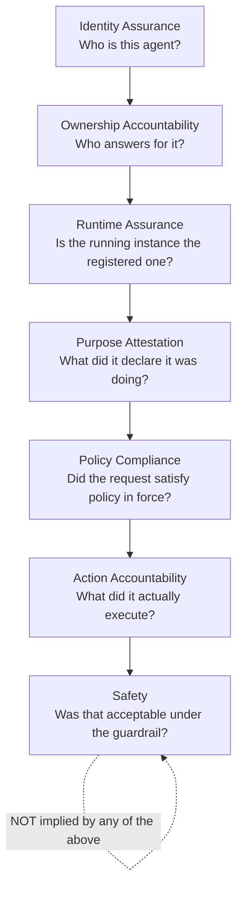

# 1–3 · Executive Summary, Problem Statement, Design Principles

> Covers sections **1**, **2** and **3** of the UAI Architecture & Protocol Definition v0.1.

---

## §1 Executive Summary

Universal Agent Identity (UAI) is an open protocol and reference implementation that gives
autonomous AI agents a portable, cryptographically verifiable identity, and gives the rest
of the world a way to attribute actions to that identity.

It is built from four artifacts, deliberately named so that a non-specialist understands
them on first contact:

| Artifact | Analogy | What it is technically |
|---|---|---|
| **UAI-ID** | national ID number | A globally unique, time-sortable identifier, 1:1 with a W3C DID (`did:uai:agent:<ULID>`) |
| **UAI Credential** | digital certificate | A W3C Verifiable Credential signed by an issuer, binding the UAI-ID to an owner, capabilities and metadata |
| **UAI Passport** | passport | A time-bounded credential authorizing an agent to act across jurisdictions, with allowed/restricted regions and an assurance level |
| **UAI Action Attestation** | notarized receipt | A signed, hash-chained record that a specific identity performed a specific class of action under a specific policy version |

Around those four artifacts the system provides: a registry, a credential issuer, a policy
decision point backed by signed OPA/Rego bundles (the *Global Agent Safety Convention*), an
append-only transparency log with Merkle inclusion proofs, a permissioned EVM consortium
ledger anchoring commitments, a preventive quarantine mechanism, a human-only governance
council for permanent revocation, and SDKs that make the correct path the easy path.

**The single sentence that defines the product:**

> Every autonomous AI action should be attributable to a cryptographically verifiable identity.

**The single sentence that defines its limits:**

> Identity enables accountability. It does not create safety, and it cannot stop code from
> running outside the ecosystem.

## §2 Problem Statement

### 2.1 The attribution gap

An autonomous agent today executes actions — moving money, changing DNS, opening firewall
rules, emailing customers, modifying production infrastructure — and the evidence left
behind is, at best, an application log line containing a self-asserted string:

```json
{ "agent_id": "support-bot-3", "action": "refund", "amount": 4200 }
```

Nothing in that record is verifiable. Any process that can write to the log can write that
line. The consequences:

1. **No attribution.** After an incident nobody can prove *which* agent instance acted,
   who deployed it, or what it believed it was authorized to do.
2. **No portability.** Identity, when it exists, is a row in one vendor's database. Move the
   agent from one provider to another and the history is gone.
3. **No verifiable ownership.** "This agent belongs to ACME" is a claim in a support ticket,
   not a cryptographic fact.
4. **No revocation.** There is no mechanism by which an organization that has never met the
   agent's operator can learn that its credentials are no longer to be honored.
5. **No policy provenance.** When a guardrail allows an action, the exact rule version that
   allowed it is usually unrecoverable a month later.
6. **Cross-border invisibility.** An agent running in one jurisdiction routinely acts on
   infrastructure, data and people in others. Nothing records that this happened.

### 2.2 What existing building blocks do and do not solve

| Existing standard | What it gives us | What is missing for agents |
|---|---|---|
| W3C DID / VC | Portable identifiers and signed claims | No agent-specific semantics, no runtime binding, no action record |
| SPIFFE/SPIRE | Strong *workload* identity, short-lived X.509-SVIDs | Scoped to one trust domain; no persistent cross-org identity, no accountability layer |
| OAuth 2 / OIDC | Delegated authorization for users and clients | Bearer-token model; `client_id` is not proof of possession by default; no cross-org revocation semantics |
| Certificate Transparency / Sigstore / SCITT | Append-only proof that a statement existed | Not applied to agent actions; no identity lifecycle or governance |
| Model/provider agent IDs | Convenience within one vendor | Proprietary, non-portable, unverifiable by third parties |

UAI does not replace any of these. It composes them and adds the missing layer: an
agent-specific identity lifecycle plus an action accountability record that a third party can
verify without trusting the party that issued it.

### 2.3 The seven questions UAI answers

These are kept strictly separate throughout the architecture. Collapsing any two of them is
a design error.



`Identity ≠ Safety`. A fully verified agent can do harm. UAI's contribution is that after it
does, the record is complete, tamper-evident, and independently checkable.

## §3 Design Principles

### P1 — Attribution, not absolution
UAI never asserts an agent will not cause harm. It asserts who acted, under what declared
authority, under which policy version, with what cryptographic evidence.

### P2 — Voluntary by construction
Registration is opt-in. Unregistered agents are **not** labeled malicious. The only correct
statement about them is: *"No verifiable UAI identity exists that would allow these actions
to be cryptographically attributed."* Relying parties MAY adopt
`ALLOW_VERIFIED_AGENTS_ONLY` for sensitive operations; that is their policy, not UAI's verdict.

### P3 — No global kill switch
A protocol cannot stop a binary from executing on a disconnected machine. Revocation is
defined in terms of what *participants* will accept. Any documentation, UI string or API
response that implies otherwise is a bug.

### P4 — Verifiable without trusting the registrar
Every consequential statement (identity, credential, policy, action, decision, vote) is
signed, committed to a transparency log, and anchored on-chain. A verifier can check a claim
against the log and the ledger even if the UAI registry itself is lying. The registry is a
convenience, not a root of truth.

### P5 — Proof of possession, always
`agent_id` in a JSON body proves nothing. Every state-changing operation requires a signature
from a key the actor demonstrably controls, over a server-issued challenge or an RFC 9421
message signature. INV-002 in [§20](13-threat-model.md).

### P6 — Separation of powers
Identity, governance, policy, audit, execution and ledger are separate services with separate
credentials and separate failure domains. The system must remain sound in the presence of a
malicious UAI administrator ([§24 role](10-governance-revocation.md)).

### P7 — Humans decide irreversible things
AI may detect, classify, correlate and recommend. `PERMANENT_REVOCATION` requires signed
votes from human delegates meeting a policy-defined threshold. Enforced in the smart contract,
not only in application code.

### P8 — Suspicion is not guilt
Quarantine is preventive, reversible, time-boxed and auto-expiring. Language, data model and
UI must never present a suspicion as a finding.

### P9 — Data minimization at every layer
The ledger stores commitments, never content. The transparency log stores digests, never
payloads. Evidence lives encrypted in a vault. Commitments are salted so that a low-entropy
payload cannot be recovered by dictionary attack on its hash.

### P10 — Policy is data, not code
International rules are versioned, signed, machine-readable bundles (`GASC-2027.4`),
distributed and hash-anchored. Nothing about jurisdictions or harm thresholds is compiled
into a service binary.

### P11 — Open protocol first, product second
Wire formats, schemas and test vectors are published and implementable by anyone. A vendor
must be able to build a conformant verifier from this document alone.

### P12 — Fail safe, and say which way
Every enforcement point declares its failure mode explicitly (fail-closed for capability and
passport checks; fail-open with mandatory logging for advisory monitoring), and the chosen
mode is itself recorded in the decision record.

### P13 — Reversibility bias
Of two designs with equal security, prefer the one whose mistakes can be undone. Quarantine
expires by default; revocation does not, which is exactly why it requires a human quorum.

### P14 — Cost of abuse
Every mechanism that can be used against an innocent agent — accusation, quarantine,
suspicion — has explicit anti-abuse controls: rate limits, reporter identity, evidence
requirements, auto-expiry, and a permanent record of who accused whom.
