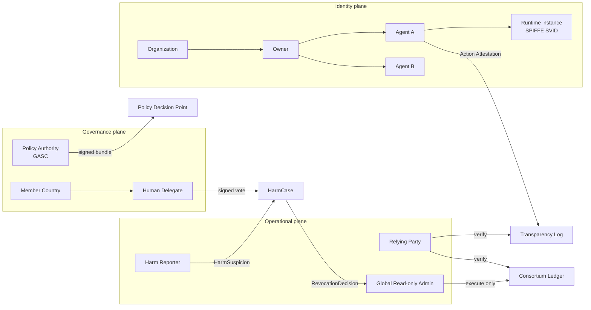
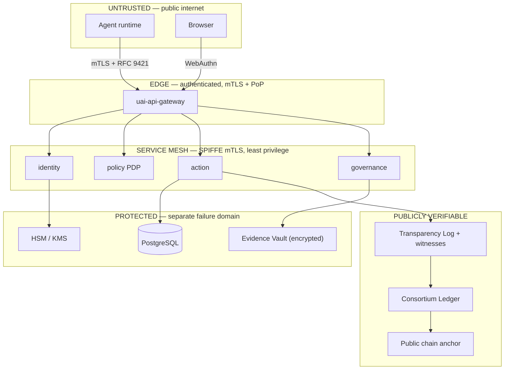

# 4–5 · Actors and Trust Model

> Covers sections **4** and **5**.

---

## §4 Actors

### 4.1 Principal actors

| Actor | Kind | Holds | Can do | Cannot do |
|---|---|---|---|---|
| **Agent** | Non-human software | Agent signing key (`did:uai:agent:…`), runtime SVID, credentials, passport | Bind/unbind itself, request capabilities, attest actions, request policy decisions | Vote, issue credentials to itself, revoke anything, alter its own history |
| **Owner** | Human or legal person | Owner key (`did:uai:owner:…` / `did:web`) | Assert ownership of agents, grant capabilities, request passports, respond to cases | Vote in council, alter evidence, revoke another owner's agent |
| **Organization** | Legal entity | Org key (`did:web` preferred) | Contain owners and agents, hold `OrganizationCredential`, run a validator/witness | Act as a council delegate by itself |
| **Relying Party (Verifier)** | Any system | Nothing (verification is offline-capable) | Verify identity, status, passport, attestations; enforce its own admission policy | Change any UAI state |
| **Credential Issuer** | UAI service or accredited org | Issuer key in HSM | Issue/renew/suspend credentials it issued | Forge an owner's or delegate's signature |
| **Policy Authority (GASC)** | Consortium body | Bundle signing keys (M-of-N) | Publish signed policy bundles, define thresholds and taxonomy | Decide individual cases |
| **Harm Reporter** | Human, org, monitor, or automated guardrail | Own identity | File a `HarmSuspicion` with evidence commitments | Quarantine directly, or remain anonymous to auditors |
| **Investigator** | Accredited human | Delegate/investigator credential | Collect evidence, advance a `HarmCase`, recommend | Vote unless also a delegate; edit submitted evidence |
| **Human Delegate** | Human, appointed by a member country | Hardware-backed WebAuthn credential | Cast one signed `YES`/`NO` vote per case | Delegate the vote to software, vote twice silently |
| **Member Country** | State-level participant | Member Country Credential | Appoint/rotate delegates, run a validator | Cast a vote directly (only its delegates can) |
| **Global Read-only Admin** | Human operator | Admin credential + hardware key | Read everything; execute an already-authorized revocation | Create/edit agents, quarantine, vote, edit evidence or policy |
| **Witness** | Independent operator | Witness key | Co-sign transparency checkpoints | Modify log content |
| **Validator** | Consortium member node | Validator key | Participate in QBFT consensus | Rewrite finalized history alone |

### 4.2 Non-actors (explicitly)

- **AI systems as decision-makers in governance.** An LLM may summarize a case. It may not
  hold a delegate credential, cast a vote, or authorize revocation (INV-005).
- **The UAI Foundation as an arbiter of existence.** UAI does not decide which agents may
  exist. It decides which credentials participants will honor.

### 4.3 Actor relationship

## §5 Trust Model

### 5.1 Trust anchors

A conformant verifier needs exactly three roots, all of which are public and auditable:

1. **The GASC policy bundle signing keys** (M-of-N consortium keys) — establishes which
   policy versions are authentic.
2. **The transparency log's public key set and its witness keys** — establishes that a
   checkpoint is genuine and not a split view.
3. **The consortium ledger's validator set** (genesis + on-chain governance history) —
   establishes which anchors are final.

Everything else — the registry API, the credential service, the web UI — is untrusted
infrastructure whose output is checkable against those three anchors.

### 5.2 What each party must trust

| Party | Must trust | Must NOT need to trust |
|---|---|---|
| Relying party | Log witnesses, ledger validators, GASC keys | UAI registry API, the agent, the owner |
| Owner | Its own key custody | UAI operators for the integrity of its agents' history |
| Agent | Its key custody + its SPIRE trust domain | Any other agent |
| Delegate | Its own authenticator, the case digest shown to it | The admin, the web frontend (vote digest is verified on the signing device) |
| Auditor | Nothing beyond the three anchors | Everything else |

### 5.3 Adversary assumptions

The design assumes an adversary who can:

- steal a private key that is not hardware-backed;
- compromise any single UAI service, including the registry database;
- compromise the Global Read-only Admin account entirely;
- compromise up to `f` validators where `3f + 1 ≤ n` (QBFT bound);
- compromise one member country's delegate;
- submit unlimited false accusations;
- observe all network traffic;
- replay any message it has seen.

The design does **not** claim to survive:

- simultaneous compromise of a quorum of human delegates *and* their hardware authenticators
  (this is the explicit human trust floor);
- compromise of more than `f` validators plus all witnesses simultaneously;
- an owner who intentionally runs an unregistered clone of its own agent outside the
  ecosystem (see P3 — out of scope by construction).

### 5.4 Trust boundaries

Crossing any boundary requires authentication; no component trusts another because of
network position ([§29 Zero Trust](16-deployment.md)).

### 5.5 Failure semantics

| Compromised | Detectable? | Contained by | Residual effect |
|---|---|---|---|
| Registry DB | Yes — content mismatches log inclusion proofs | Transparency log | Denial of service, not forgery |
| Credential issuer key | Yes — issuance appears in log without a matching request | Log + issuer key rotation + status lists | Fraudulent credentials until rotation, all visible |
| Admin account | Yes — every admin action is signed and logged | Contract-level verification of governance proof | Read-only exposure; cannot revoke without real votes |
| One delegate | Yes — vote appears with valid signature | Threshold (e.g. 4-of-5) | One fraudulent vote, insufficient alone |
| Transparency log operator | Yes — witnesses refuse to co-sign an inconsistent checkpoint | Independent witnesses | Split-view attempt fails or is provable |
| `f` validators | Yes | QBFT | Liveness degradation |
| Agent key (software) | Only after the fact | Runtime attestation, chain fork detection, rotation | Forged attestations until detection — the strongest argument for hardware backing |
