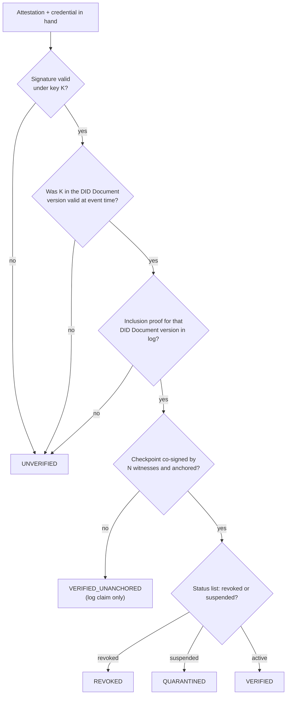
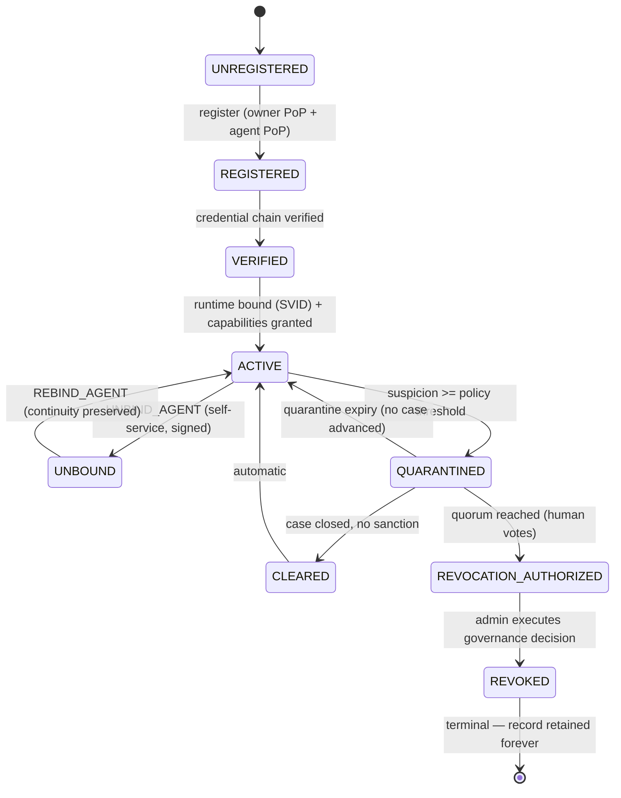

# 6 · Identity Architecture

> Covers section **6**. Together with [04-cryptography.md](04-cryptography.md) this is the
> minimum a third-party verifier must implement.

---

## 6.1 The UAI-ID

```text
uai:agent:01JY8R9ZAF392N7QX2T81JH6KM
│   │     └── ULID, 26 chars, Crockford base32, uppercase
│   └──────── entity class: agent | owner | org | delegate | country
└──────────── URN-style scheme prefix, lowercase, fixed
```

ABNF:

```abnf
uai-id      = "uai:" entity ":" ulid
entity      = "agent" / "owner" / "org" / "delegate" / "country"
ulid        = 26( "0"-"9" / "A"-"H" / "J"-"K" / "M"-"N" / "P"-"T" / "V"-"Z" )
```

Properties:

- **Globally unique** — 48-bit millisecond timestamp + 80 bits of CSPRNG entropy.
- **Time-sortable** — lexicographic order equals creation order, which makes it a natural
  primary key and a natural partition key for `action_events`.
- **Opaque** — carries no owner, vendor, jurisdiction or model information. All of that is in
  credentials, which can change; the identifier never does.
- **Case-normalized** — MUST be emitted uppercase; verifiers MUST accept case-insensitively
  and normalize before comparison.

> **Rejected alternative:** embedding the organization or country in the identifier. It leaks
> data forever, breaks on reorganization, and creates a namespace authority. Rejected under P9.

## 6.2 The DID: one identifier, two spellings

UAI defines the DID method `did:uai`. The method-specific identifier is *exactly* the UAI-ID
with the `uai:` scheme replaced by `did:uai:`:

```text
UAI-ID :  uai:agent:01JY8R9ZAF392N7QX2T81JH6KM
DID    :  did:uai:agent:01JY8R9ZAF392N7QX2T81JH6KM
```

There is no mapping table, no second registry, no possibility of drift. Conversion is a string
operation both ways. This is a deliberate simplification: two identifiers for one thing is a
defect factory.

### 6.2.1 Supported DID methods per entity class

| Entity | MUST support | SHOULD support | Rationale |
|---|---|---|---|
| Agent | `did:uai` | `did:key` (pre-registration, self-issued) | Agents are the thing UAI registers |
| Owner (individual) | `did:uai` | `did:key`, `did:web` | Individuals may not want a hosted identifier |
| Organization | `did:web` | `did:uai` | An org already controls a domain; `did:web` avoids lock-in and is the interop bridge |
| Delegate | `did:uai` | — | Bound to hardware authenticators, must be registry-tracked |
| Member country | `did:web` | `did:uai` | Sovereign entities SHOULD control their own resolution |

Allowing `did:web` for organizations is what makes UAI non-captive: an organization can prove
who it is using infrastructure UAI does not control.

### 6.3 DID Document

Resolution endpoint: `GET https://resolver.uai.world/1.0/identifiers/{did}` returning a
DID Resolution Result per W3C DID Resolution. Offline resolution from the transparency log is
also normative — see 6.6.

```json
{
  "@context": [
    "https://www.w3.org/ns/did/v1",
    "https://w3id.org/security/suites/jws-2020/v1",
    "https://uai.world/ns/did/v1"
  ],
  "id": "did:uai:agent:01JY8R9ZAF392N7QX2T81JH6KM",
  "controller": ["did:web:acme-robotics.example"],
  "verificationMethod": [
    {
      "id": "did:uai:agent:01JY8R9ZAF392N7QX2T81JH6KM#key-1",
      "type": "JsonWebKey2020",
      "controller": "did:uai:agent:01JY8R9ZAF392N7QX2T81JH6KM",
      "publicKeyJwk": { "kty": "OKP", "crv": "Ed25519", "x": "…" }
    },
    {
      "id": "did:uai:agent:01JY8R9ZAF392N7QX2T81JH6KM#key-2-tpm",
      "type": "JsonWebKey2020",
      "controller": "did:uai:agent:01JY8R9ZAF392N7QX2T81JH6KM",
      "publicKeyJwk": { "kty": "EC", "crv": "P-256", "x": "…", "y": "…" },
      "uai:keyProtection": "TPM2",
      "uai:attestationFormat": "tpm-2.0-certify"
    }
  ],
  "authentication": ["#key-1", "#key-2-tpm"],
  "assertionMethod": ["#key-1", "#key-2-tpm"],
  "service": [
    { "id": "#uai-verify", "type": "UAIVerification",
      "serviceEndpoint": "https://verify.uai.world/uai:agent:01JY8R9ZAF392N7QX2T81JH6KM" },
    { "id": "#uai-status", "type": "BitstringStatusList",
      "serviceEndpoint": "https://status.uai.world/lists/agents/17" }
  ],
  "uai:metadata": {
    "created": "2026-09-22T14:02:01Z",
    "versionId": 3,
    "logIndex": 184213,
    "previousDocumentHash": "sha256:9f2c…"
  }
}
```

Rules:

- Every version of the DID Document MUST be committed to the transparency log before it is
  served. `uai:metadata.logIndex` is the leaf index; a verifier MUST be able to obtain an
  inclusion proof for it.
- Documents are **versioned and hash-chained** (`previousDocumentHash`). Silent key
  substitution by a compromised registry is therefore detectable.
- Keys are never deleted from history; a retired key gains `uai:revokedAt` and stays in the
  document version where it was valid, so old attestations remain verifiable (6.7).

## 6.4 Credential family

All credentials are W3C Verifiable Credentials v2.0 with Data Integrity proofs
(`eddsa-jcs-2022` or `ecdsa-jcs-2019`), and MAY additionally be issued as SD-JWT VC where
selective disclosure matters.

| Credential | Issuer | Subject | Key claims | Typical validity |
|---|---|---|---|---|
| `AgentIdentityCredential` | UAI Credential Service or accredited issuer | Agent DID | name, version, agentType, vendor/model, framework, created, assuranceLevel | 12 months |
| `AgentOwnershipCredential` | Owner (self-issued, countersigned by org) | Agent DID | ownerDid, orgDid, bindingProof, effectiveFrom | Until unbound |
| `AgentCapabilityCredential` | Owner or org, within its own grant | Agent DID | capabilities[], constraints, riskClass, maxAssuranceRequired | ≤ 90 days |
| `OrganizationCredential` | UAI or accredited registrar | Org DID | legalName, jurisdiction, registrationRef, contact | 24 months |
| `AgentPassportCredential` | UAI Passport Service | Agent DID | allowed/restricted jurisdictions, capabilities, assuranceLevel, policyVersion | ≤ 180 days |
| `AgentSafetyAttestation` | Owner, vendor or accredited evaluator | Agent DID | evaluations[], guardrailConfigHash, evaluatorDid, scope | ≤ 12 months |
| `AgentRevocationCredential` | Governance Service | Agent DID | caseId, decisionId, governanceProofHash, effectiveAt | Permanent |

`AgentSafetyAttestation` deserves a warning in its own schema description: it records that an
evaluation *was performed and by whom*, never that the agent *is safe* (P1).

### 6.4.1 Ownership is proven, not declared

`AgentOwnershipCredential` requires a two-sided proof, otherwise anyone could claim anyone's
agent, or an owner could disown an agent retroactively:

```mermaid
sequenceDiagram
    participant O as Owner
    participant A as Agent
    participant R as uai-agent-registry
    O->>R: POST /agents (ownership intent, signed by owner key)
    R-->>O: challenge_o (nonce, exp 300s)
    O->>R: signature_o over jcs({challenge_o, agent_did, owner_did})
    R->>A: challenge_a (nonce, exp 300s)
    A->>R: signature_a over jcs({challenge_a, agent_did, owner_did})
    R->>R: verify both; both MUST reference the same (agent_did, owner_did) pair
    R-->>O: AgentOwnershipCredential (mutual proof embedded)
    R->>R: commit to transparency log + ledger
```

The credential embeds both signatures. A verifier can check ownership without contacting UAI.

## 6.5 Runtime identity (execution assurance)

Persistent identity answers *who*. It cannot answer *is the process making this call actually
that agent*. That is `Runtime Assurance`, and it is delegated to SPIFFE/SPIRE.

```text
Persistent:  did:uai:agent:01JY8R9ZAF392N7QX2T81JH6KM      (years)
Runtime   :  spiffe://uai.world/agents/01JY8R9ZAF392N7QX2T81JH6KM/i/7f6a92   (minutes)
```

- SPIRE issues **X.509-SVIDs** with a default TTL of 1 hour (MVP) / 5 minutes (production
  target), used for mutual TLS to the gateway.
- The binding between the SVID and the agent DID is itself an attested event
  (`runtime_identities` table + `RuntimeBound` attestation), signed by the agent's persistent
  key. A stolen SVID with no matching binding event is detectable.
- Workload attestation selectors (k8s namespace + service account + image digest, or systemd
  unit + binary digest) tie the SVID to a specific artifact, which is what makes
  "is the running software the registered software" answerable at all.
- **No static secrets in agent code** (P5). An agent that needs a bootstrap secret has already
  lost; SPIRE node attestation (cloud instance identity doc, TPM, k8s PSAT) replaces it.

## 6.6 Verification without trusting the registry

A verifier presented with `uai:agent:01JY…` and an attestation MUST be able to conclude
correctness using only the three trust anchors from [§5.1](02-actors-trust.md):



Note `VERIFIED_UNANCHORED`: between an event and its next on-chain anchor there is a window
(target: ≤ 60 s) where only the log vouches for it. Verifiers MUST be able to express that
state rather than silently treating it as full verification.

## 6.7 Key lifecycle and the "valid at event time" rule

The single most common verification bug in systems like this is checking a historical
signature against the *current* key set. UAI makes the correct behavior normative:

> A signature over an event MUST be verified against the key material that was valid at the
> event's **log-attested time**, not at verification time, and not at the self-asserted
> `timestamp` field.

Consequences:

- Key rotation does not invalidate history.
- Key compromise has a precise blast radius: events after the compromise's log time are
  suspect; events before it remain sound.
- The self-asserted `timestamp` inside an attestation is untrusted input. The log's
  entry time is the authority. Both are stored; a large divergence is itself a signal
  (`CLOCK_SKEW_ANOMALY`).

Rotation protocol: new key added to DID Document (signed by current key) → document version
committed to log → grace period where both keys are accepted → old key marked `revokedAt`.
Emergency rotation (suspected compromise) skips the grace period and MUST create a
`KeyCompromiseDeclared` event, which makes every later event signed by the old key invalid.

## 6.8 Assurance levels

Relying parties need a compact way to express "how strongly is this identity established".

| Level | Key protection | Owner verification | Runtime attestation | Typical use |
|---|---|---|---|---|
| **UAI-AL0** | Software key, self-generated | Self-asserted | None | Experimentation, local dev |
| **UAI-AL1** | Software key, registry-bound | Email/domain control | SPIFFE SVID | Low-risk automation |
| **UAI-AL2** | Hardware-backed (TPM/Enclave/KMS) | Organization credential verified | SVID + workload attestation with image digest | Business operations, CRM, email |
| **UAI-AL3** | HSM, FIPS 140-3 L3 or equivalent | Legal-entity verification + accredited registrar | Remote attestation of the execution environment | Financial movement, critical infrastructure, cross-border autonomy |

Capability grants and passports reference a **minimum** assurance level. A `wire.transfer`
capability requiring AL3 cannot be exercised by an AL1 identity even if the capability was
granted — the PDP checks both.

## 6.9 Identity status vocabulary

The public, verifier-facing statuses (never inferred from silence):

| Status | Meaning | What a relying party should do |
|---|---|---|
| `UAI_VERIFIED` | Identity + owner + credential chain cryptographically verified, not revoked | Proceed per own policy |
| `UAI_REGISTERED` | Identity exists and is registered, but some verification is incomplete (e.g. owner unverified, AL0) | Treat as weak identity; may require step-up |
| `UAI_UNVERIFIED` | No verifiable UAI identity was presented | **Not** an accusation. Apply own policy (e.g. `ALLOW_VERIFIED_AGENTS_ONLY`) |
| `UAI_QUARANTINED` | Preventive, reversible restriction in force | Deny sensitive capabilities; suspicion is not guilt |
| `UAI_REVOKED` | Governance-authorized permanent revocation executed | Reject credentials |

## 6.10 Agent state machine (§34)



Normative rules:

1. Every transition is validated server-side against this machine; the client never asserts a
   target state.
2. Every transition emits a signed `StateTransition` event with `before_state_hash` and
   `after_state_hash`, is written to the transparency log, and is anchored.
3. `UNBOUND` does not delete anything. The event chain continues across unbind/rebind;
   `REBIND_AGENT` MUST reference the last event hash prior to unbinding, preserving
   cryptographic continuity.
4. `REVOKED` is terminal and irreversible by protocol. The row is never deleted (INV-006);
   status changes, history stays.
5. `QUARANTINED → ACTIVE` by expiry is **mandatory** unless a case has advanced past
   `EVIDENCE_COLLECTION`. Preventive measures must not become punishment by inertia (P13).
