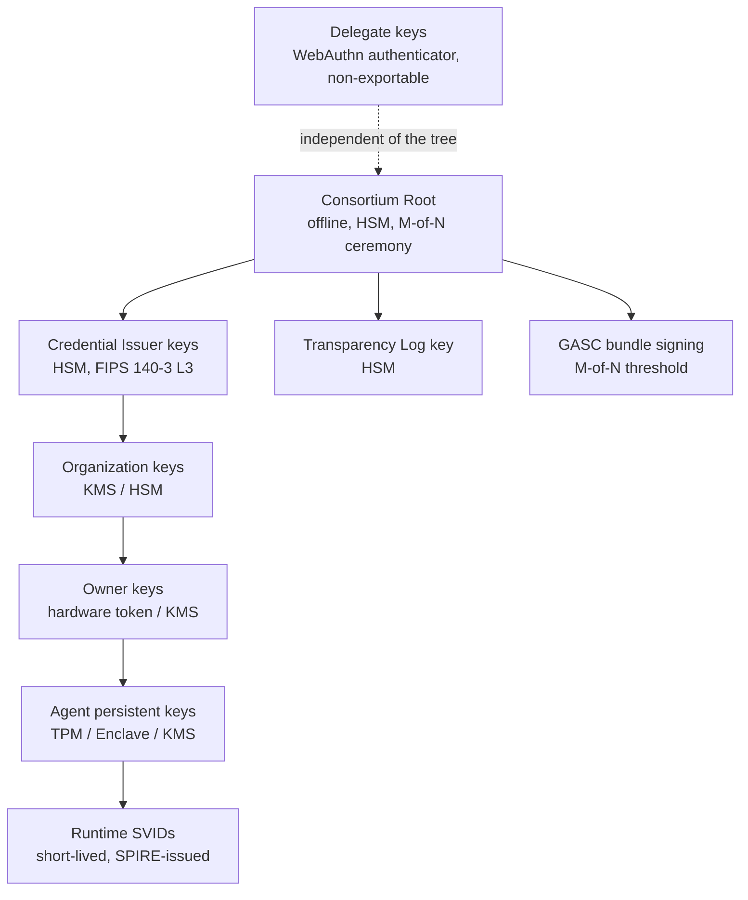

# 7 · Cryptographic Architecture

> Covers section **7**. Normative. A verifier implementing this file plus
> [03-identity.md](03-identity.md) is conformant.

---

## 7.1 Cipher suite `UAI-CS-1`

| Purpose | Algorithm | Identifier | Notes |
|---|---|---|---|
| Signature (software / general) | Ed25519 (RFC 8032) | `EdDSA` / `eddsa-jcs-2022` | MUST implement (verify) |
| Signature (hardware-backed) | ECDSA P-256 + SHA-256 | `ES256` / `ecdsa-jcs-2019` | MUST implement (verify). TPMs, Secure Enclave, WebAuthn and most cloud KMS do P-256, not Ed25519 |
| Signature (HSM, high assurance) | ECDSA P-384 + SHA-384 | `ES384` | SHOULD implement |
| Hash | SHA-256 | `sha256` | All commitments, Merkle nodes, chain links |
| Hash (long-term anchors) | SHA-384 | `sha384` | MAY be used for public-chain anchors |
| Canonicalization | JCS (RFC 8785) | `jcs` | Applied before every hash/sign of a JSON object |
| Key agreement (evidence vault) | X25519 or ECDH P-256 | — | Envelope encryption |
| AEAD (evidence vault) | AES-256-GCM (or XChaCha20-Poly1305) | — | Per-object data key |
| KDF | HKDF-SHA-256 | — | Domain-separated |
| Randomness | CSPRNG, ≥ 128 bits | — | ULID entropy, nonces, salts |

Rationale for dual mandatory signature algorithms: an Ed25519-only suite would exclude
hardware-backed keys on most platforms, and hardware backing is the main defense against the
single worst threat in the model (agent key theft, [§30](13-threat-model.md)). A P-256-only
suite would be slower and would discard Ed25519's misuse resistance. Verifiers implement both;
signers choose based on their key protection.

**Post-quantum:** out of scope for v0.1 but the design is prepared — signature envelopes carry
an explicit `alg`, the DID Document supports multiple concurrent verification methods, and
`UAI-CS-2` is reserved for a hybrid (ML-DSA + Ed25519) suite. No format change will be needed.

## 7.2 Canonicalization and domain separation

Every hash and every signature in UAI is computed over:

```text
input = DOMAIN || 0x00 || jcs(payload)
```

where `DOMAIN` is an ASCII string from this registry. Domain separation prevents a signature
produced in one context from being replayed as valid in another — a real and frequently
exploited class of bug.

| Domain string | Used for |
|---|---|
| `UAI-v1:attestation` | Action attestations |
| `UAI-v1:credential` | Verifiable credential proofs |
| `UAI-v1:did-document` | DID Document versions |
| `UAI-v1:registration` | Registration records; the genesis hash of an event chain |
| `UAI-v1:challenge` | Registration / binding challenge responses |
| `UAI-v1:vote` | Human delegate votes |
| `UAI-v1:decision` | Policy decision records |
| `UAI-v1:policy-bundle` | M-of-N approval signatures over a GASC bundle |
| `UAI-v1:quarantine` | Quarantine orders |
| `UAI-v1:revocation` | Revocation decisions |
| `UAI-v1:checkpoint` | Transparency log checkpoints |
| `UAI-v1:commitment` | Content commitments (see 7.3) |
| `UAI-v1:audit` | Audit event records |
| `UAI-v1:capability-request` | An agent asking for a capability it does not hold (22.9) |
| `UAI-v1:suspicion` | Signed harm reports (14.1) |
| `UAI-v1:passport` | Passport requests and the passport credential subject binding (11) |

Implementations MUST reject a signature whose domain does not match the context in which it is
being verified, even if the signature is otherwise cryptographically valid.

## 7.3 Commitments — salted, never bare hashes

Action inputs and outputs, evidence and PII are represented on the wire and on-chain by
commitments, never by content. A bare `SHA-256(content)` is **not acceptable**: low-entropy
content (an email address, an amount, a customer ID, a yes/no answer) is trivially recovered
by dictionary attack against the hash.

```text
salt       = CSPRNG(32 bytes)                       # stored ONLY in the evidence vault
commitment = SHA-256("UAI-v1:commitment" || 0x00 || salt || content_bytes)
wire form  = "sha256:" || hex(commitment)
```

- The salt never leaves the vault and never touches the ledger.
- Disclosure = revealing `(salt, content)` to an authorized party, who recomputes the
  commitment and compares. This is how evidence is presented in a `HarmCase` without ever
  having published it.
- **Crypto-shredding**: destroying the salt and the ciphertext key makes the content
  unrecoverable while the commitment — and therefore the integrity of history — survives. This
  is the mechanism that reconciles "immutable record" with erasure obligations
  ([§19 Privacy](12-privacy.md)).

For content that must be verifiable by anyone without disclosure (policy bundles, public
schemas), an unsalted hash is used and the field is named `*_hash`, not `*_commitment`. The
naming distinction is normative so that a reviewer can see the privacy property from the field
name alone.

## 7.4 Merkle trees (RFC 6962 profile)

```text
leaf_hash(d)       = SHA-256(0x00 || d)
interior(l, r)     = SHA-256(0x01 || l || r)
empty_tree         = SHA-256("")
```

The `0x00` / `0x01` prefixes are second-preimage protection; without them an interior node can
be forged as a leaf. UAI uses the RFC 6962 profile unchanged so that existing CT tooling and
proof verifiers work against UAI logs.

- **Inclusion proof**: audit path from leaf to root, `O(log n)` hashes.
- **Consistency proof**: proves tree at size `n₁` is a prefix of tree at size `n₂`, which is
  what makes "append-only" verifiable rather than merely asserted.
- **Checkpoint** (C2SP `tlog-checkpoint` style):

```text
uai.world/log/1
184213
9f2c1b…base64 root…
— uai-log  <signature>
— witness-de  <signature>
— witness-jp  <signature>
```

## 7.5 Signature envelopes

Two interoperable encodings, both carrying identical semantics:

**A. Data Integrity proof** (default for credentials and anything JSON-LD):

```json
{
  "proof": {
    "type": "DataIntegrityProof",
    "cryptosuite": "eddsa-jcs-2022",
    "created": "2026-09-22T14:02:04Z",
    "verificationMethod": "did:uai:agent:01JY…#key-1",
    "proofPurpose": "assertionMethod",
    "domain": "UAI-v1:attestation",
    "challenge": "3f9a…",
    "proofValue": "z5kR…"
  }
}
```

**B. COSE_Sign1 / JWS compact** (default for constrained agents, SDK internals and the MCP
transport): protected header carries `alg`, `kid` (the DID URL) and `uai-domain`.

A verifier MUST accept both. The canonical bytes signed are identical (7.2), so a payload can
be re-encoded between the two without invalidating the signature.

## 7.6 Proof of possession

Three mechanisms, chosen by transport:

### 7.6.1 HTTP message signatures (RFC 9421) — default for the REST API

```http
POST /actions/attest HTTP/1.1
Host: api.uai.world
UAI-Agent-Id: uai:agent:01JY8R9ZAF392N7QX2T81JH6KM
Content-Digest: sha-256=:9f2c…:
Signature-Input: uai=("@method" "@target-uri" "content-digest" "uai-agent-id" "uai-nonce");\
  created=1790000524;keyid="did:uai:agent:01JY…#key-1";alg="ed25519";tag="UAI-v1:attestation"
Signature: uai=:MEUCIQ…:
UAI-Nonce: 8f1c2b…
```

Requirements: `created` within ±300 s of server time; `UAI-Nonce` unique per key within a
600 s window (server-side replay cache); `Content-Digest` covered by the signature. A request
missing any covered component MUST be rejected with `401 UAI_POP_REQUIRED`.

### 7.6.2 Challenge–response — for registration, binding, unbinding, rebinding

Server issues a single-use challenge (32 bytes, 300 s TTL) bound to the operation and the
subject. The response signs `DOMAIN || 0x00 || jcs({challenge, operation, subject, audience})`.
Binding the audience prevents a challenge captured by one service being replayed at another.

### 7.6.3 Mutual TLS with SPIFFE X.509-SVID — for transport-level identity

mTLS proves *the runtime instance*; message signatures prove *the persistent identity*. Both
are required for high-assurance operations, because either alone is insufficient: a stolen
SVID has no persistent key, and a stolen persistent key has no attested runtime.

> DPoP (RFC 9449) is supported as an alternative for environments that cannot sign HTTP
> messages, and is explicitly documented as the weaker option.

## 7.7 Key hierarchy and protection



Delegate keys hang outside the hierarchy deliberately: governance must not be compromisable by
compromising the operational root (P6).

| Key | Protection | Rotation | On compromise |
|---|---|---|---|
| Consortium root | Offline HSM, M-of-N, air-gapped ceremony | 5 years | Full ceremony, new genesis anchor |
| Credential issuer | HSM, non-exportable | 12 months | Rotate + reissue + status-list all credentials issued after suspected time |
| Log signing | HSM | 12 months | New log epoch, consistency proof across epochs |
| GASC signing | M-of-N threshold, separate custodians | per-version | Threshold means single compromise is insufficient |
| Agent persistent | TPM/Enclave/KMS at AL2+ | ≤ 12 months | `KeyCompromiseDeclared`, emergency rotation, events after declared time invalid |
| Runtime SVID | Memory only, never persisted | 1 h (MVP) / 5 min (target) | Expires on its own; revoke via SPIRE entry deletion |
| Delegate | Hardware authenticator, user verification required | on appointment change | Member country appoints replacement; old votes remain valid for their time |

## 7.8 Nonces, clocks and replay

- Every signed operation carries a `nonce` (≥ 128 bits) and a `timestamp`.
- The server maintains a replay cache keyed `(key_id, nonce)` with a TTL greater than the
  accepted clock skew window.
- **Self-asserted timestamps are untrusted.** Ordering authority is the transparency log's
  entry sequence. Both values are persisted; divergence beyond policy threshold raises
  `CLOCK_SKEW_ANOMALY` and is visible in the action explorer.
- Attestation chains add a second, independent replay defense: a replayed attestation would
  have to match `previous_event_hash`, which is already consumed.

## 7.9 Test vectors (normative for conformance)

`spec/test-vectors/` carries, for each set below, inputs, intermediate canonical bytes and
expected outputs, so an independent implementation can self-check without running any code from
this repository. `tools/uai-conformance` runs them and reports a verdict.

The vectors are generated by `tools/uai-vectors` and **committed**. Test suites read the
committed files and never regenerate expectations: a test that writes its own expected values
proves only that an implementation agrees with itself, which is exactly the gap published
vectors exist to close. Regeneration is deterministic, so a diff means the protocol changed.

| Vector set | File | Covers |
|---|---|---|
| JCS canonicalization | `jcs/canonicalization.json` | RFC 8785 edge cases: member ordering, UTF-16 ordering across the BMP boundary, ECMAScript number formatting, escaping |
| Domain separation | `digest/domain-separation.json` | `SHA-256(DOMAIN ‖ 0x00 ‖ payload)` for all 11 domains, and that no two share a digest for one payload |
| Salted commitments | `commitment/salted-commitment.json` | Derivation, opening, and that the same content under two salts yields different commitments |
| Merkle hashing | `merkle/hashing.json` | RFC 6962 leaf/interior prefixes and the empty-tree root |
| Merkle proofs | `merkle/tree-proofs.json` | Roots, inclusion proofs and consistency proofs for 8 tree sizes |
| Ed25519 signatures | `signature/ed25519.json` | Deterministic signature bytes, plus cross-domain and tampered-payload cases that MUST fail |
| ECDSA signatures | `signature/ecdsa.json` | P-256 and P-384 verification with fixed-width R‖S, plus cross-domain failure |
| Identifiers | `identifier/uai-id.json` | UAI-ID/DID parsing, canonicalization, Crockford folding, and 8 inputs that MUST be rejected |
| Event chain | `attestation/event-chain.json` | Chain linkage and a **fork**: two events claiming the same predecessor |
| HTTP message signatures | `pop/rfc9421.json` | Exact signature base strings, `Signature-Input` serialization, and cases that MUST be rejected: cross-domain tag, swapped target URI, tampered body |

Every set contains negative cases. An implementation that passes only the positive vectors has
not demonstrated domain separation, rejection of malformed identifiers, or fork detection — and
those are the properties the protocol actually rests on.

The RFC 9421 set pins the **signature base as an exact string**. That is deliberate: two
implementations can agree on every cryptographic primitive and still fail to verify each other
because one emits a trailing newline or leaves a component name unquoted, and the disagreement
stays invisible until it matters.

> **Not yet published:** `webauthn/vote-*.json` (vote digest to WebAuthn challenge binding).
> It describes behavior that arrives with the voting service; publishing vectors for
> unimplemented behavior would be the same overclaim this section exists to avoid.

An implementation that reproduces every published vector byte-for-byte is `UAI-CS-1` conformant.
