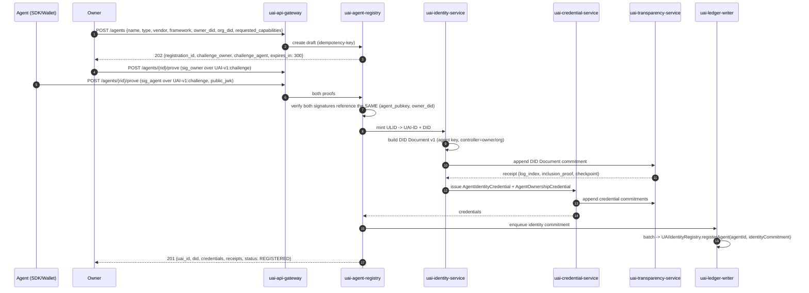
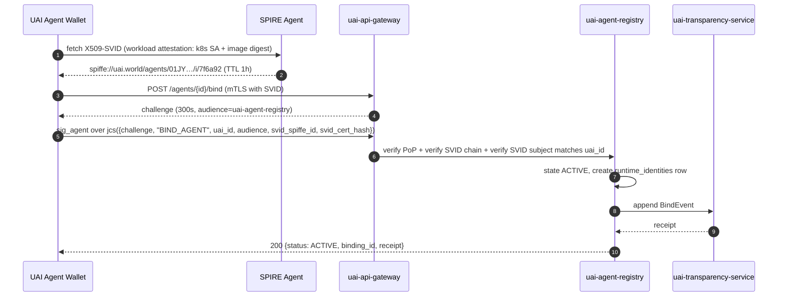
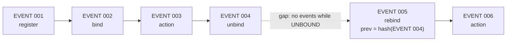

# 8–9 · Agent Registration and Binding Protocols

> Covers sections **8** and **9**. Implements the self-binding principle (§9 of the product
> brief): an agent binds and unbinds itself without administrator intervention.

---

## §8 Agent Registration Protocol

### 8.1 Preconditions

| Requirement | Why |
|---|---|
| Owner holds a verified `OrganizationCredential` or an individual owner identity | Ownership must be attributable to a real party (§8 product brief) |
| Agent has generated a key pair it controls | Registration establishes possession, it does not distribute keys |
| Agent key is hardware-backed if target assurance ≥ AL2 | [§6.8](03-identity.md) |
| Idempotency key present | Registration is expensive and must be safely retryable ([§22](15-api.md)) |

UAI never generates an agent's private key. A registry that can generate your key can
impersonate you, which would void the entire attribution claim.

### 8.2 Flow



### 8.2.1 The statement both halves sign

Two details of 8.2 are easy to get wrong, and both were found by implementing it.

**The agent is named by its key, not by its DID.** §6.4.1 draws the ownership proof over
`jcs({challenge, agent_did, owner_did})`. That shape is right for the
`AgentOwnershipCredential`, which is issued after the fact — but it cannot be what is signed
*during* registration, because at that moment the agent has no DID. The ULID is minted only
once both proofs verify. 8.2 says so precisely: the registry checks that both signatures
reference the same **`(agent_pubkey, owner_did)`**.

So the subject is the RFC 7638 thumbprint of the agent's public key. That is also the stronger
binding of the two: a DID is an assertion *about* a key, while the thumbprint *is* the key.

```json
{
  "challenge": "<the challenge issued for this role>",
  "registration_id": "reg_01JY8R9ZAF392N7QX2T81JH6KM",
  "role": "owner",
  "agent_key_thumbprint": "sha256:…",
  "owner_did": "did:uai:owner:01JY8R9ZB00000000000000000"
}
```

Canonicalized with RFC 8785 and signed under `UAI-v1:challenge`. The owner half and the agent
half differ in exactly two members — `role` and `challenge` — and must agree on every other
one. `role` is redundant while the two challenges are distinct random values, and it is kept
precisely so that a future change to challenge issuance cannot silently make one half's
signature replayable as the other's.

Consequences that follow, and that an implementation MUST enforce:

| Rule | Why |
|---|---|
| The owner half MUST carry `agent_key_thumbprint` | A signature that does not name the agent key vouches for nothing. Without this member the "same subject" check of 8.2 cannot be expressed at all. |
| The owner half MUST NOT carry `public_jwk` | The owner proves control of a key the registry already holds. A key taken from the request body would make ownership self-asserted — the exact failure 6.4.1 exists to prevent. |
| The agent half MUST carry `public_jwk` | UAI never generates an agent's key, so it is introduced here. |
| The first proof fixes the subject; the second MUST match it | Otherwise the party that goes first could rewrite what it vouched for after seeing the other half. |
| A submitted proof is final | Same reason, one step later. |

**The `{rid}` in `POST /agents/{rid}/prove` is a registration identifier.** It shares a path
position with `GET /agents/{uai_id}` while meaning something different, so registration ids
carry a `reg_` prefix and the two are impossible to confuse. Passing a UAI-ID there is a
`400 UAI_MALFORMED_IDENTIFIER`, not a `404`: the resource does not merely happen to be missing,
it cannot exist yet.

An unanswered registration mints nothing — no identifier, no DID, no record any verifier can
see. That is what makes it safe for this to be the one write path in UAI without proof of
possession: the cost of spamming it is a row that expires in 300 seconds.

### 8.3 Registration record

The registry stores, and the transparency log commits to:

```json
{
  "uai_id": "uai:agent:01JY8R9ZAF392N7QX2T81JH6KM",
  "did": "did:uai:agent:01JY8R9ZAF392N7QX2T81JH6KM",
  "logical_name": "DeliveryOptimizer",
  "version": "1.4.2",
  "agent_type": "autonomous_task_agent",
  "org_did": "did:web:acme-robotics.example",
  "owner_did": "did:uai:owner:01JY8R9ZB0000000000000000",
  "vendor_model": { "vendor": "anthropic", "model_family": "claude", "pinned": false },
  "framework": "langgraph@0.2.x",
  "requested_capabilities": ["route.optimize", "crm.customer.read"],
  "assurance_level": "UAI-AL2",
  "primary_jurisdiction": "AR",
  "issued_at": "2026-09-22T14:02:01Z",
  "status": "REGISTERED",
  "identity_commitment": "sha256:…",
  "policy_version": "GASC-2027.4",
  "transparency": { "log_index": 184213, "checkpoint_size": 184300 }
}
```

`vendor_model.pinned = false` is meaningful: an agent's identity survives a model swap. Pinning
is available for agents whose assurance argument depends on a specific model version.

Two digests are derived from this record and they are not interchangeable:

- **`genesis_event_hash`** = `SHA-256("UAI-v1:registration" || 0x00 || jcs(record))`. It anchors
  the event chain: the first attestation references it as `previous_event_hash`, so a verifier
  walking backwards from any action reaches registration through an unbroken hash path
  ([§9.4](#94-event-chain-across-bindunbind)). It has its own domain rather than borrowing
  `UAI-v1:attestation`, because a genesis record is not a claim about an action — sharing a
  domain would let a crafted attestation hash be presented as an identity's origin.
- **`identity_commitment`** = a salted commitment over the same record ([§7.3](04-cryptography.md)).
  This is what reaches the consortium ledger. It is salted because the record is short and
  guessable: an unsalted hash of it would be an index, not a commitment. The salt stays in the
  registry, and a commitment whose salt was discarded could never be opened — which would make
  it decorative rather than evidence.

### 8.4 Status after registration

Registration yields `REGISTERED`, not `VERIFIED`. Promotion to `VERIFIED` requires the full
credential chain to validate (owner credential → org credential → issuer), and promotion to
`ACTIVE` additionally requires a runtime binding (§9). This staging is what makes
`UAI_REGISTERED` vs `UAI_VERIFIED` a meaningful distinction for relying parties
([§6.9](03-identity.md)).

### 8.5 Errors

| Condition | Code | HTTP |
|---|---|---|
| Owner proof and agent proof disagree on subject | `UAI_PROOF_MISMATCH` | 400 |
| Challenge expired or reused | `UAI_CHALLENGE_INVALID` | 401 |
| Owner credential revoked or suspended | `UAI_OWNER_NOT_ELIGIBLE` | 403 |
| Owner is `OWNER_RESTRICTED` and agent risk class is high | `UAI_OWNER_RESTRICTED` | 403 |
| Duplicate idempotency key, different body | `UAI_IDEMPOTENCY_CONFLICT` | 409 |
| Requested capability exceeds owner's own grant | `UAI_CAPABILITY_EXCEEDS_GRANT` | 403 |

Capabilities can never be self-elevated: an owner may only grant what it holds (§49 of the
product brief, restated here as a registry invariant).

## §9 Agent Binding Protocol

Binding is the act of associating a **runtime instance** with a **persistent identity**, and of
declaring participation in UAI. Three operations, all self-service, all requiring proof of
possession, all producing signed, logged, anchored events.

### 9.1 `BIND_AGENT`



The signature covers both the persistent-key challenge **and** the SVID identifiers. That is
what cryptographically ties "who I am" to "where I am running" — either alone would be
forgeable by an attacker holding the other.

### 9.2 `UNBIND_AGENT`

An agent may leave UAI at any time without asking anyone. This is a stated principle, and it is
also a security property: a protocol you cannot leave is a protocol operators will refuse to
adopt.

```text
ACTIVE ──UNBIND_AGENT──▶ UNBOUND
```

Requirements:

1. Proof of possession by the agent key (or by the owner key, for the case of a lost agent).
2. A signed `UnbindEvent` containing the reason code and the last event hash.
3. Transparency log entry + ledger commitment.
4. **History is retained in full.** Unbinding is not deletion (INV-006). Existing attestations
   remain verifiable forever.
5. Runtime SVID entries are removed from SPIRE; in-flight credentials are added to the status
   list as `suspended` with reason `unbound`.

Verifier semantics for `UNBOUND`: *"This identity exists and its history is intact, but it is
not currently participating."* It is not a negative signal about past behavior.

### 9.3 `REBIND_AGENT`

```text
UNBOUND ──REBIND_AGENT──▶ ACTIVE
```

Cryptographic continuity is mandatory:

```json
{
  "operation": "REBIND_AGENT",
  "uai_id": "uai:agent:01JY…",
  "previous_event_hash": "sha256:…",        // last event before unbinding
  "unbound_at_log_index": 184913,
  "rebound_key": "did:uai:agent:01JY…#key-2",
  "continuity_proof": "signature by a key that was valid at unbind time"
}
```

If the agent key rotated while unbound, the `continuity_proof` MUST be produced by a key that
was valid at the moment of unbinding, and the new key MUST be introduced through a normal,
logged DID Document version. Without this rule, "unbind, rotate, rebind" would be a laundering
path for a stolen identity.

### 9.4 Event chain across bind/unbind



The chain does not restart. A verifier walking backwards from any action reaches the
registration event through an unbroken hash path, regardless of how many bind cycles occurred.

### 9.5 Idempotency and concurrency

- All three operations require an `Idempotency-Key`. Replays return the original result.
- Concurrent bind attempts from two instances of the same agent are allowed (an agent may run
  replicated) — each produces its own `runtime_identities` row with a distinct SVID, but they
  share the persistent identity and append to a **single** event chain, serialized by the action
  service using a per-agent sequence with optimistic concurrency on `previous_event_hash`.
- A rejected append due to a stale `previous_event_hash` returns `409 UAI_CHAIN_CONFLICT` with
  the current head, and the SDK retries. Two *successful* appends claiming the same predecessor
  are impossible within one service; if they are ever observed across services, that is a fork
  and is treated as an incident ([§10.6](06-action-attestation.md)).
