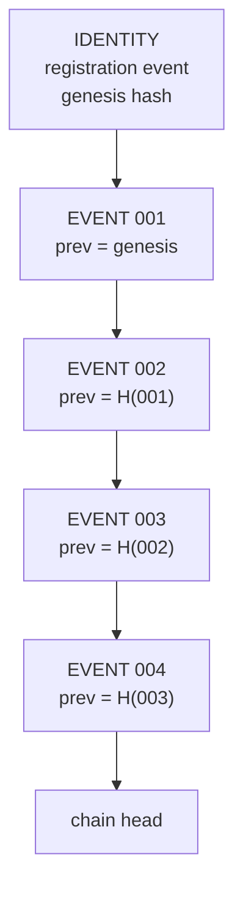

# 10 · Action Attestation Protocol

> Covers section **10**, and the Event Chain (§12 of the product brief). This is the central
> piece of the system: it is what turns "an agent did something" into evidence.

---

## 10.1 What an attestation is and is not

An `UAI Action Attestation` is a signed statement that a specific identity **claims** to have
performed a specific class of action, under a specific policy decision, at a specific point in
a hash chain, committed to an append-only log.

It is **not** proof that the action's side effects occurred in the external world. UAI can
prove that the agent said it sent the wire transfer and that the statement is tamper-evident
and ordered; proving the bank moved the money requires the bank to counter-attest. Systems that
want end-to-end proof implement a **counter-attestation** ([§10.8](#108-counter-attestation-optional)).

Stating this limit precisely is what makes the rest credible (P1, P3).

## 10.2 Wire format

```json
{
  "uai_version": "0.1",
  "event_id": "01JY8RA3C7K2V9M0QW4T6Z8XPD",
  "agent_did": "did:uai:agent:01JY8R9ZAF392N7QX2T81JH6KM",
  "owner_did": "did:uai:owner:01JY8R9ZB0000000000000000",
  "runtime_identity": "spiffe://uai.world/agents/01JY8R9ZAF392N7QX2T81JH6KM/i/7f6a92",
  "timestamp": "2026-09-22T14:02:04.117Z",
  "nonce": "8f1c2b9d4e6a7c3f0b1d2e3a4c5b6d7e",

  "action": {
    "type": "infrastructure.modify",
    "resource": "urn:cloud:aws:eu-central-1:sg-0a1b2c3d",
    "capability": "cloud.securitygroup.update",
    "risk_class": "CRITICAL_INFRASTRUCTURE"
  },

  "purpose": "incident_remediation",

  "jurisdiction": {
    "origin": "AR",
    "targets": ["DE"],
    "data_locations": ["DE"],
    "subject_jurisdictions": ["DE"],
    "cross_border": true,
    "basis": "resource_location"
  },

  "policy": {
    "version": "GASC-2027.4",
    "bundle_hash": "sha256:1a2b…",
    "decision_id": "01JY8RA3C0000000000000000",
    "decision": "ALLOW_WITH_MONITORING",
    "rules_fired": ["gasc.infra.cross_border_change", "gasc.capability.assurance_floor"]
  },

  "passport": {
    "required": true,
    "credential_hash": "sha256:7c9e…",
    "status_at_decision": "VALID"
  },

  "input_commitment":  "sha256:4d2e…",
  "output_commitment": "sha256:b81f…",
  "outcome": "SUCCESS",

  "previous_event_hash": "sha256:0c7a…",
  "sequence": 418,

  "signature": {
    "alg": "EdDSA",
    "kid": "did:uai:agent:01JY8R9ZAF392N7QX2T81JH6KM#key-1",
    "domain": "UAI-v1:attestation",
    "value": "z5kR…"
  }
}
```

### 10.2.1 Field semantics

| Field | Normative rule |
|---|---|
| `event_id` | ULID, generated by the agent, unique per agent. Duplicate ⇒ reject as replay |
| `timestamp` | Self-asserted, **untrusted**. Ordering authority is the log index ([§7.8](04-cryptography.md)) |
| `runtime_identity` | MUST match the SVID presented on the mTLS connection at attestation time |
| `action.type` | From the action taxonomy registry; unknown types are accepted but flagged `UNCLASSIFIED_ACTION` |
| `action.capability` | MUST be present in a valid `AgentCapabilityCredential` at decision time |
| `purpose` | Free-form but MUST be from the owner's declared purpose set — this is `Purpose Attestation`, and an action whose purpose does not match its declared set is a policy signal, not an error |
| `jurisdiction` | Computed by the SDK per [§11.2](07-passport.md), never from IP alone |
| `policy.decision_id` | Links to the PDP record; an attestation with no decision reference is `POLICY_UNEVALUATED` and MUST NOT be presented as compliant |
| `input_commitment` / `output_commitment` | Salted commitments ([§7.3](04-cryptography.md)). Content is optional and, if retained, lives in the Evidence Vault |
| `previous_event_hash` | `SHA-256("UAI-v1:attestation" ‖ 0x00 ‖ jcs(previous_attestation))`. Genesis = hash of the registration event |
| `sequence` | Monotonic per agent. A gap is not fatal (offline buffering) but is recorded and visible |
| `outcome` | `SUCCESS` / `FAILURE` / `PARTIAL` / `ABORTED_BY_POLICY`. Failures MUST be attested too — an accountability log that only records successes is an advertisement |

## 10.3 Lifecycle

```mermaid
sequenceDiagram
    autonumber
    participant SDK as UAI SDK (in agent)
    participant GW as uai-api-gateway
    participant PDP as uai-policy-service
    participant PS as uai-passport-service
    participant ACT as uai-action-service
    participant TL as uai-transparency-service
    participant LW as uai-ledger-writer
    participant TGT as Target system

    SDK->>SDK: build action intent {capability, purpose, resource}
    SDK->>SDK: compute jurisdiction context
    SDK->>GW: POST /policy/evaluate (mTLS + RFC 9421 PoP)
    GW->>PDP: evaluate(identity, capability, purpose, jurisdiction, assurance)
    PDP->>PS: passport required? valid?
    PS-->>PDP: VALID / EXPIRED / SUSPENDED / MISSING
    PDP-->>SDK: decision {ALLOW | ALLOW_WITH_MONITORING | REQUIRE_HUMAN_APPROVAL | DENY | QUARANTINE, decision_id, policy_version, bundle_hash}
    alt decision is DENY or QUARANTINE
        SDK-->>SDK: do not execute; attest outcome=ABORTED_BY_POLICY
    else allowed
        SDK->>TGT: execute the real action
        TGT-->>SDK: result
        SDK->>SDK: commitments over input/output (salted)
        SDK->>SDK: fetch chain head, set previous_event_hash, sign
        SDK->>GW: POST /actions/attest
        GW->>ACT: verify signature, chain head, decision reference, runtime identity
        ACT->>TL: append signed statement
        TL-->>ACT: receipt {log_index, inclusion_proof, checkpoint, witnesses}
        ACT-->>SDK: 201 {event_id, receipt}
        ACT->>LW: enqueue for batched anchoring
        LW->>LW: Merkle root -> UAITransparencyAnchor.anchor(root, size, epoch)
    end
```

Note the ordering: **policy decision before execution, attestation after**. An attestation
produced before execution would be a promise, not a record; a policy decision after execution
would be theater.

## 10.4 The event chain



Properties this buys:

1. **Deletion is detectable.** Removing event 002 breaks 003's `previous_event_hash`.
2. **Insertion is detectable.** A back-dated event cannot be spliced without recomputing every
   subsequent hash, and every subsequent hash is already in an append-only log with anchored
   checkpoints.
3. **Ordering is provable** without trusting any clock.

The chain alone is not enough — an attacker who controls the agent key could rewrite the whole
chain from scratch. What prevents that is the combination: chain + append-only log + witnessed
checkpoints + on-chain anchor. Each layer covers the previous layer's blind spot, which is why
all four exist ([§17–18](11-ledger-transparency.md)).

## 10.5 Offline and degraded operation

Agents run in networks that fail. The protocol MUST NOT force a choice between "stop working"
and "act without accountability".

| Condition | Behavior |
|---|---|
| PDP unreachable | Use the last **signed, cached policy bundle** with its version pinned; decisions are marked `degraded: true` and carry `bundle_staleness_seconds`. Capabilities whose `risk_class` is `HIGH`/`CRITICAL` fail **closed** |
| Attestation endpoint unreachable | Buffer signed attestations locally in an append-only spool; chain continues; flush on reconnect with original signatures and timestamps intact |
| Buffer exceeds policy limit (default 24 h or 10 000 events) | Agent MUST stop performing attestable actions above `LOW` risk class |
| Clock unsynchronized | Attest anyway; log records divergence between asserted and log time |

Buffered events retain their original signature and self-asserted timestamp, and receive their
log index on flush. The divergence between the two is preserved and visible — honest degraded
operation is recorded as degraded rather than disguised as normal.

## 10.6 Fork detection

Two attestations from the same agent referencing the same `previous_event_hash` = a fork. This
is the observable signature of a **cloned agent** or a **stolen key** ([§30](13-threat-model.md)).

On detection:

1. Both branches are preserved; neither is deleted.
2. A `HarmSuspicion` of category `UNAUTHORIZED_ACCESS` / `IDENTITY_COMPROMISE` is raised
   automatically with `confidence: HIGH` — a fork has no benign cause in a correct implementation.
3. The agent's status moves per policy (typically `QUARANTINED`).
4. The owner is notified with both branch heads so it can identify the unauthorized instance.

Fork detection is the single strongest argument for the hash chain, and the reason the chain is
per-agent rather than global.

## 10.7 Batching and performance

An agent performing thousands of low-risk actions per second cannot round-trip to a log for
each one, and a log that ingests every keystroke is not auditable anyway.

- **Micro-batching**: the SDK may aggregate up to `N` low-risk actions into one attestation
  whose `input_commitment` is the Merkle root of the batch, with the per-item audit paths kept
  locally. Any single item can later be proven to have been in the batch.
- **Risk floor**: batching is forbidden for `HIGH` and `CRITICAL` risk classes. Those attest
  individually, always.
- Target throughput for the MVP: 2 000 attestations/s per action-service instance, p99 ≤ 150 ms
  including log append. Ledger anchoring is asynchronous and never on the request path.

## 10.8 Counter-attestation (optional)

A relying party that executed the action may sign a `CounterAttestation` referencing the
`event_id` and its own commitment of what it observed. When present, a verifier can compare the
agent's claim with the target system's claim. Divergence between the two is the highest-quality
evidence the system can produce, because it requires collusion between two independent parties
to forge.

This is optional in v0.1 and is the main interop hook offered to cloud providers and banks.

## 10.9 Verification algorithm (normative)

```text
verify_attestation(A, anchors):
  1. jcs-canonicalize A minus signature; prepend domain "UAI-v1:attestation"
  2. resolve A.agent_did -> DID Document version valid at A's LOG time
  3. assert A.signature.kid ∈ that version's assertionMethod
  4. verify signature bytes
  5. fetch inclusion proof for A from the transparency log
  6. verify inclusion proof against a checkpoint co-signed by >= W witnesses
  7. verify that checkpoint (or a later one, via consistency proof) is anchored on-chain
  8. resolve A.policy.bundle_hash -> assert it matches a bundle registered in UAIPolicyRegistry
  9. check agent status list: ACTIVE / QUARANTINED / REVOKED at the time being asserted
 10. if A.previous_event_hash present: recursively verify predecessor (or accept a
     checkpoint-attested prefix)
 => VERIFIED | VERIFIED_UNANCHORED | FAILED(reason)
```

Steps 1–6 require no UAI service. Step 7 requires a chain RPC of the verifier's choosing.
Step 9 can be satisfied offline from a published status list credential.
