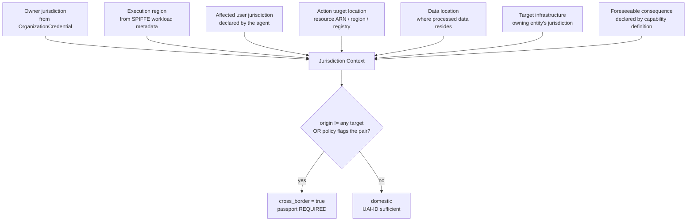
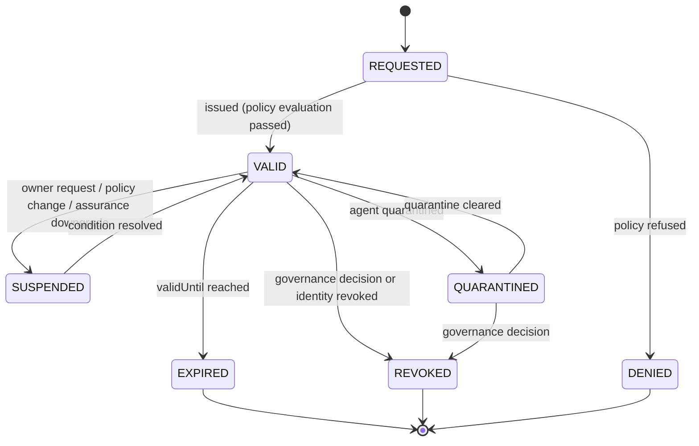

# 11 · Passport Protocol

> Covers section **11**. The `UAI Passport` is the artifact that makes cross-jurisdictional
> agent action legible.

---

## 11.1 Why a passport, separate from the credential

The `UAI Credential` answers *who this agent is*. It is not the right instrument for
*where this agent is allowed to act*, for three reasons:

1. Jurisdictional authorization is **time-bounded and revocable independently** of identity.
   Suspending a passport must not invalidate the identity or its history.
2. It is **scoped**: an agent may be authorized for `DE` and `AR` but not `US` for the same
   capability.
3. It is **policy-versioned**: authorization is granted under a specific `GASC` version and
   must be re-evaluated when that version changes.

An agent operating entirely inside its own jurisdiction and capability envelope needs only its
UAI-ID. The passport is required only when the action crosses a boundary that policy says
matters.

## 11.2 Jurisdiction determination — not by IP

The execution IP is the weakest available signal: VPNs, CDNs, multi-region schedulers and
serverless placement all make it meaningless. UAI computes a jurisdiction context from seven
inputs and records how it was derived.



Worked example from the product brief: an agent executing in **Argentina** that modifies
infrastructure located in **Germany** is `CROSS_BORDER_ACTION`, with `origin: AR`,
`targets: ["DE"]`, `basis: "resource_location"` — even though every packet originated in
Argentina and no German IP was involved.

`basis` is normative and MUST be one of: `owner_jurisdiction`, `execution_region`,
`subject_jurisdiction`, `resource_location`, `data_location`, `infrastructure_owner`,
`declared_consequence`. It records *why* the system concluded what it concluded, which is
exactly what an auditor or a regulator will ask.

Conflicting signals resolve by **union, not by precedence**: if any input indicates a foreign
jurisdiction, all such jurisdictions enter `targets`. Under-declaring jurisdiction is the
failure mode with real-world consequences; over-declaring merely requires a passport.

## 11.3 `AgentPassportCredential`

```json
{
  "@context": ["https://www.w3.org/ns/credentials/v2", "https://uai.world/ns/passport/v1"],
  "type": ["VerifiableCredential", "AgentPassportCredential"],
  "id": "urn:uai:passport:01JY8RB1Q4X7N2M8V0K3T5S9WE",
  "issuer": "did:web:passport.uai.world",
  "validFrom": "2026-09-22T00:00:00Z",
  "validUntil": "2027-03-21T00:00:00Z",
  "credentialStatus": {
    "type": "BitstringStatusListEntry",
    "statusPurpose": "revocation",
    "statusListIndex": "94212",
    "statusListCredential": "https://status.uai.world/lists/passports/3"
  },
  "credentialSubject": {
    "id": "did:uai:agent:01JY8R9ZAF392N7QX2T81JH6KM",
    "owner": "did:uai:owner:01JY8R9ZB0000000000000000",
    "allowedJurisdictions": ["AR", "BR", "DE", "ES"],
    "restrictedJurisdictions": ["KP", "IR"],
    "authorizedCapabilities": [
      { "capability": "cloud.securitygroup.update", "minAssurance": "UAI-AL3",
        "constraints": { "max_actions_per_hour": 20, "requires_human_approval_above": "MODERATE" } },
      { "capability": "crm.customer.read", "minAssurance": "UAI-AL2" }
    ],
    "assuranceLevel": "UAI-AL3",
    "policyVersion": "GASC-2027.4",
    "policyBundleHash": "sha256:1a2b…",
    "state": "VALID"
  },
  "proof": { "type": "DataIntegrityProof", "cryptosuite": "ecdsa-jcs-2019", "…": "…" }
}
```

`restrictedJurisdictions` is explicit rather than implied by omission: "not listed as allowed"
and "explicitly restricted" are different facts, and the second one is the one an auditor cares
about.

## 11.4 States



| State | Cross-border action | Notes |
|---|---|---|
| `VALID` | Permitted within scope | Still subject to per-action policy evaluation |
| `EXPIRED` | Denied | Renewal is a new credential, not an extension — issuance is always re-evaluated |
| `SUSPENDED` | Denied | Reversible, no finding of fault |
| `QUARANTINED` | Denied | Follows the agent's quarantine, released with it |
| `REVOKED` | Denied permanently | Follows identity revocation |

A passport never outlives its agent's identity status: identity `REVOKED` forces passport
`REVOKED` atomically, in the same transaction and the same log batch.

## 11.5 Issuance

```mermaid
sequenceDiagram
    autonumber
    participant OW as Owner
    participant GW as uai-api-gateway
    participant PS as uai-passport-service
    participant PDP as uai-policy-service
    participant CRED as uai-credential-service
    participant TL as uai-transparency-service
    participant LW as uai-ledger-writer

    OW->>GW: POST /passports/request {agent_did, jurisdictions[], capabilities[], justification}
    GW->>PS: create request (idempotency-key)
    PS->>PDP: evaluate passport eligibility (GASC bundle)
    PDP-->>PS: ALLOW | REQUIRE_HUMAN_APPROVAL | DENY + decision_id
    alt REQUIRE_HUMAN_APPROVAL
        PS-->>OW: 202 PENDING_REVIEW
        Note over PS: human reviewer with issuer credential approves/refuses; signed either way
    end
    PS->>CRED: issue AgentPassportCredential
    CRED->>TL: append passport commitment
    TL-->>CRED: receipt
    CRED-->>PS: credential + receipt
    PS->>LW: enqueue passport issuance commitment
    LW->>LW: UAIIdentityRegistry.recordPassport(agentId, passportHash, expiry)
    PS-->>OW: 201 {passport_id, credential, receipt}
```

Eligibility inputs the PDP considers: requested jurisdictions vs. restricted lists in the GASC
bundle; agent assurance level vs. required minimum per capability; owner standing (an
`OWNER_RESTRICTED` owner cannot obtain new passports, §19 of the product brief); open harm
cases; and the agent's current status.

## 11.6 Verification at action time

The PDP performs, for every action where `cross_border = true`:

```text
1. passport present?                          else -> DENY (UAI_PASSPORT_REQUIRED)
2. signature valid, issuer trusted?           else -> DENY (UAI_PASSPORT_INVALID)
3. now within [validFrom, validUntil]?        else -> DENY (UAI_PASSPORT_EXPIRED)
4. status list says not revoked/suspended?    else -> DENY (UAI_PASSPORT_SUSPENDED)
5. no target ∈ restrictedJurisdictions?       else -> DENY (UAI_JURISDICTION_RESTRICTED)
6. every target ∈ allowedJurisdictions?       else -> DENY (UAI_JURISDICTION_NOT_ALLOWED)
7. capability ∈ authorizedCapabilities?       else -> DENY (UAI_CAPABILITY_NOT_IN_PASSPORT)
8. agent assurance >= minAssurance?           else -> DENY (UAI_ASSURANCE_INSUFFICIENT)
9. constraints satisfied (rate, approval)?    else -> REQUIRE_HUMAN_APPROVAL
=> ALLOW / ALLOW_WITH_MONITORING
```

Steps 5 and 6 are in this order because both deny and only the reported reason differs: when a
target is both unlisted and explicitly restricted, the restricted fact is the one an auditor
cares about ([11.3](#113-agentpassportcredential)), and reporting the weaker reason would hide
it.

This check is **fail-closed** without exception. If the passport service is unavailable, a
cross-border action is denied — an accountability system that degrades into permissiveness
under load is worse than none, because it creates a false record of compliance.

The resulting `passport.credential_hash` and `passport.status_at_decision` are embedded in the
action attestation ([§10.2](06-action-attestation.md)), so the passport state at decision time
is preserved even after the passport expires or is revoked.
