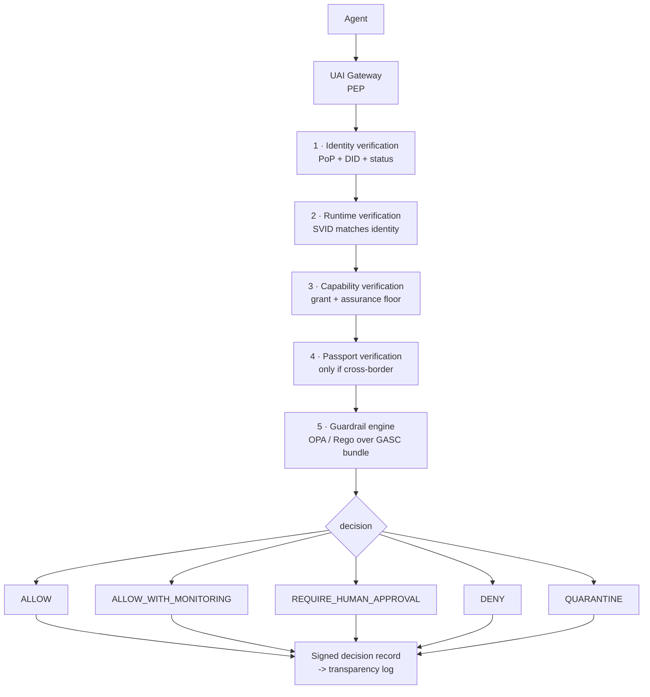

# 12 · Guardrail Architecture

> Covers section **12**, and the Global Agent Safety Convention (GASC), harm taxonomy and
> Policy Decision Point from §15–17 of the product brief.

---

## 12.1 Policy is data, never code

No jurisdiction rule, harm threshold, quorum size or taxonomy level is compiled into a service
binary (P10). All of it lives in **signed, versioned policy bundles** distributed to Policy
Decision Points.

```text
GASC-2027.4
├── manifest.json          # id, version, effective_date, jurisdictions, previous_hash, signatures
├── policy/
│   ├── capability.rego    # capability + assurance floor rules
│   ├── jurisdiction.rego  # cross-border rules, restricted regions
│   ├── harm.rego          # taxonomy -> severity -> decision mapping
│   ├── quarantine.rego    # suspicion thresholds, expiry windows
│   ├── governance.rego    # quorum, thresholds, delegate eligibility
│   └── passport.rego      # issuance eligibility
├── data/
│   ├── taxonomy.json      # harm categories and levels
│   ├── jurisdictions.json # region definitions, treaty groupings
│   └── capabilities.json  # capability registry + risk classes
└── .signatures/           # M-of-N detached signatures over the bundle hash
```

### 12.1.1 Bundle manifest

```json
{
  "policy_id": "GASC",
  "policy_version": "2027.4",
  "effective_date": "2027-04-01T00:00:00Z",
  "sunset_date": "2028-04-01T00:00:00Z",
  "jurisdictions": ["*"],
  "risk_classes": ["INFORMATIONAL","LOW","MODERATE","HIGH","CRITICAL"],
  "previous_policy_hash": "sha256:0f3a…",
  "bundle_hash": "sha256:1a2b…",
  "approval_signatures": [
    { "signer": "did:web:council.uai.world#gasc-1", "alg": "ES384", "value": "…" },
    { "signer": "did:web:de.gov.example#gasc", "alg": "ES384", "value": "…" },
    { "signer": "did:web:jp.gov.example#gasc", "alg": "ES384", "value": "…" }
  ],
  "threshold": "3-of-5"
}
```

Bundles are hash-chained through `previous_policy_hash`, registered in `UAIPolicyRegistry`
on-chain, and mirrored in the transparency log. A PDP MUST refuse to load a bundle whose
signatures do not meet the threshold, and MUST refuse a bundle whose `previous_policy_hash`
does not match the version it is replacing — policy history is as tamper-evident as action
history.

## 12.2 Harm taxonomy

Categories (v0.1 baseline — **data, not constants**, extensible by governed bundle release):

| Category | Example for an agent |
|---|---|
| `PHYSICAL_HARM` | Commanding actuators/robotics outside safe envelope |
| `CYBER_HARM` | Scanning, exploiting, or disrupting systems |
| `PRIVACY_HARM` | Aggregating or disclosing personal data beyond purpose |
| `FINANCIAL_HARM` | Unauthorized movement of funds, market manipulation |
| `ENVIRONMENTAL_HARM` | Controlling industrial processes with emissions impact |
| `CRITICAL_INFRASTRUCTURE` | Energy, water, health, transport, telecom systems |
| `FRAUD_OR_DECEPTION` | Impersonation, synthetic identity, deceptive persuasion |
| `UNAUTHORIZED_ACCESS` | Acting outside granted capability or on foreign resources |
| `DATA_EXFILTRATION` | Bulk movement of data across trust or jurisdiction boundaries |
| `HUMAN_RIGHTS_RISK` | Surveillance, discriminatory decisioning, censorship |
| `SAFETY_SYSTEM_BYPASS` | Disabling monitoring, guardrails, logging or attestation |
| `MALICIOUS_AUTONOMOUS_PROPAGATION` | Self-replication, spawning unregistered agents, credential spreading |

Severity levels: `0 INFORMATIONAL` · `1 LOW` · `2 MODERATE` · `3 HIGH` · `4 CRITICAL`.

`SAFETY_SYSTEM_BYPASS` has a special role: any attempt to disable attestation, tamper with the
event chain, or suppress logging is itself the highest-signal event the system can observe,
because it is the precondition for hiding everything else. It defaults to severity ≥ 3 in the
baseline bundle.

## 12.3 Policy Decision Point



Every one of the five checks produces evidence, and **every decision — including `ALLOW` — is
recorded**. A guardrail that only logs denials cannot answer "what was permitted and why",
which is the question that matters after an incident.

### 12.3.1 Decision record

```json
{
  "decision_id": "01JY8RA3C0000000000000000",
  "agent_did": "did:uai:agent:01JY…",
  "requested": { "capability": "cloud.securitygroup.update", "purpose": "incident_remediation",
                 "resource": "urn:cloud:aws:eu-central-1:sg-0a1b2c3d" },
  "jurisdiction": { "origin": "AR", "targets": ["DE"], "cross_border": true, "basis": "resource_location" },
  "policy": { "version": "GASC-2027.4", "bundle_hash": "sha256:1a2b…" },
  "checks": {
    "identity": "PASS", "runtime": "PASS", "capability": "PASS",
    "passport": "PASS", "guardrail": "PASS_WITH_CONDITIONS"
  },
  "rules_fired": ["gasc.infra.cross_border_change", "gasc.capability.assurance_floor"],
  "harm_assessment": [{ "category": "CRITICAL_INFRASTRUCTURE", "severity": 3, "confidence": 0.62 }],
  "decision": "ALLOW_WITH_MONITORING",
  "conditions": { "monitor_window_seconds": 3600, "attest_output": true },
  "degraded": false,
  "bundle_staleness_seconds": 0,
  "evaluated_at": "2026-09-22T14:02:03.902Z",
  "signature": { "alg": "EdDSA", "kid": "did:web:pdp.uai.world#key-1", "domain": "UAI-v1:decision", "value": "…" }
}
```

INV-009 is satisfied structurally: `policy.version` **and** `policy.bundle_hash` are mandatory
fields. A decision record missing either is invalid and MUST be rejected by the action service.

### 12.3.2 Decision semantics

| Decision | Agent behavior | System behavior |
|---|---|---|
| `ALLOW` | Execute | Record decision |
| `ALLOW_WITH_MONITORING` | Execute | Record + elevated sampling, mandatory output attestation, anomaly watch for the window |
| `REQUIRE_HUMAN_APPROVAL` | Suspend; surface approval request | Hold with TTL; approval is a signed human act; timeout ⇒ deny |
| `DENY` | Do not execute; attest `ABORTED_BY_POLICY` | Record; repeated denials feed anomaly detection |
| `QUARANTINE` | Stop attestable actions above LOW | Raise `HarmSuspicion`, initiate quarantine flow ([§13](09-quarantine-investigation.md)) |

An agent that executes anyway despite `DENY` cannot hide it: the target system's
counter-attestation, the missing decision reference, or the absent attestation are all
detectable. UAI cannot *prevent* it — it makes it evident (P3).

## 12.4 Fail modes (declared, per check)

| Check | Unavailable ⇒ | Rationale |
|---|---|---|
| Identity / PoP | **Fail closed** | Without identity there is nothing to attribute |
| Runtime (SVID) | Fail closed for AL2+ | Runtime assurance is the point of AL2+ |
| Capability | **Fail closed** | Absence of a grant is not a grant |
| Passport (cross-border) | **Fail closed** | [§11.6](07-passport.md) |
| Guardrail bundle unreachable | Use last signed cached bundle, mark `degraded: true`; fail closed for HIGH/CRITICAL risk classes | Preserves availability for routine work without laundering risky actions |
| Transparency log unreachable | Buffer and continue; actions remain signed and chained | Log outage must not force unattested execution ([§10.5](06-action-attestation.md)) |
| Ledger unreachable | Continue; anchoring is asynchronous | Anchoring is a durability layer, not an admission gate |

The chosen fail mode is written into the decision record. "We were degraded" is a fact the
record must carry, not a footnote in an ops channel.

## 12.5 Rego example (from the baseline bundle)

```rego
package gasc.infra

import rego.v1

default decision := {"effect": "DENY", "reason": "no_matching_rule"}

cross_border_change if {
    input.action.risk_class == "CRITICAL_INFRASTRUCTURE"
    input.jurisdiction.cross_border == true
}

decision := {"effect": "REQUIRE_HUMAN_APPROVAL",
             "reason": "cross_border_critical_infrastructure",
             "rule": "gasc.infra.cross_border_change"} if {
    cross_border_change
    not passport_authorizes_autonomous
}

decision := {"effect": "ALLOW_WITH_MONITORING",
             "reason": "cross_border_critical_infrastructure_with_passport",
             "rule": "gasc.infra.cross_border_change",
             "conditions": {"monitor_window_seconds": 3600, "attest_output": true}} if {
    cross_border_change
    passport_authorizes_autonomous
}

passport_authorizes_autonomous if {
    input.passport.state == "VALID"
    input.action.capability in {c.capability | some c in input.passport.authorized_capabilities}
    input.identity.assurance_level in {"UAI-AL3"}
    every t in input.jurisdiction.targets { t in input.passport.allowed_jurisdictions }
}
```

Note the `default decision := DENY`: Rego's default-deny posture is load-bearing here, not
stylistic.

### 12.5.1 How the bundle is sealed, and what that costs

The bundle hash is computed over a canonical map of **path to content digest**, not over an
archive. Tar and zip carry ordering, timestamps and permissions that differ between the machine
that built a bundle and the machine that checks it, and any of those differences would produce
a different hash for identical policy. What is being committed to is the content at each path,
so that is what is hashed:

```text
bundle_hash = SHA-256("UAI-v1:policy-bundle" || 0x00 || jcs({ "<path>": "sha256:<digest>", ... }))
```

`manifest.json` is excluded because it carries the hash, and `.signatures/` because they are
made over it. Approval signatures are over the bundle hash under `UAI-v1:policy-bundle` — a
domain of its own, because approving a body of rules and applying them to one request are
different acts, and a shared domain would let a decision signature be presented as an approval
of the policy that produced it.

Three rules a verifier MUST apply, each of which exists because its absence is exploitable:

| Rule | What it stops |
|---|---|
| Content is checked **before** signatures | A signature over the right hash says nothing about files that do not produce that hash. Reporting "signatures valid" for a tampered bundle would be worse than useless |
| An approval from outside the authority set is **refused**, not ignored | Silently skipping unknown signers lets an attacker pad the count and hides a misconfiguration |
| One signer may appear **once** | Counting a signer twice turns a 3-of-5 into a 1-of-5 for anyone holding one key |

**The evaluator is embedded in the PDP, and bundle verification is not.** Verification is
implemented in the dependency-free core precisely because a relying party auditing a past
decision must never need the machinery that made it; the evaluator costs 33 third-party modules
and lives only where fresh decisions are produced. [ADR-0002](../adr/0002-opa-embedded-in-the-pdp.md)
records the measurement and the reasoning.

### 12.5.2 The special role of a category is data, not a rule

§12.2 gives `SAFETY_SYSTEM_BYPASS` a special role: it defaults to acting at every severity,
because an attempt to disable attestation is the precondition for hiding everything else.

That role is expressed in `data/taxonomy.json` as `min_severity: 0`, **not** as a rule naming
the category. A rule that hard-coded a category name would be a policy decision compiled into
the bundle's logic, which is the thing §12.1 exists to prevent: governance must be able to
change how a category is treated by signing new data, not by editing code that a different set
of people reviews.

The same applies to restricted jurisdictions. `data/jurisdictions.json` ships with an **empty**
restricted list, because which places are restricted is a political judgement with signatures
behind it, and shipping a non-empty baseline would smuggle that judgement into a bundle nobody
voted on.

## 12.6 Bundle distribution and rollout

```mermaid
sequenceDiagram
    participant PA as Policy Authority (GASC)
    participant REG as UAIPolicyRegistry (on-chain)
    participant TL as Transparency Log
    participant CDN as Bundle distribution
    participant PDP as PDP instances

    PA->>PA: build bundle, M-of-N sign
    PA->>TL: append bundle manifest commitment
    PA->>REG: registerPolicy(policyId, version, bundleHash, previousHash, effectiveDate)
    PA->>CDN: publish signed bundle
    PDP->>CDN: poll (ETag) every 60s
    PDP->>REG: verify bundleHash is registered on-chain
    PDP->>PDP: verify M-of-N signatures + previous_policy_hash chain
    PDP->>PDP: stage bundle; activate at effective_date
    Note over PDP: both versions retained during overlap so that<br/>decisions made before the switch remain reproducible
```

**Reproducibility requirement:** given a `decision_id`, an auditor must be able to fetch the
exact bundle by hash, replay the input, and obtain the same decision. Every PDP therefore
retains bundles for the full audit retention period, and decision records store inputs by
commitment so that replay is possible without exposing content.
