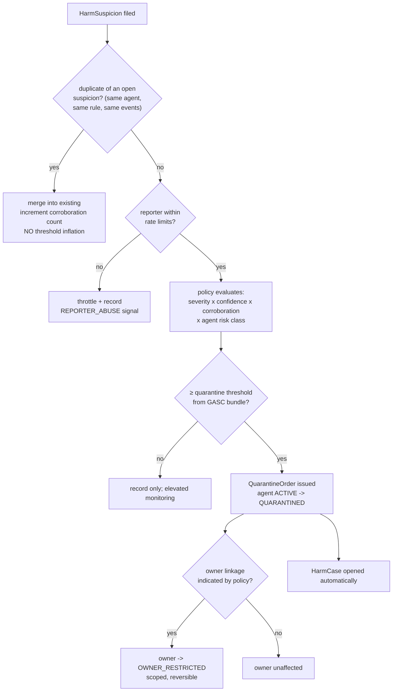
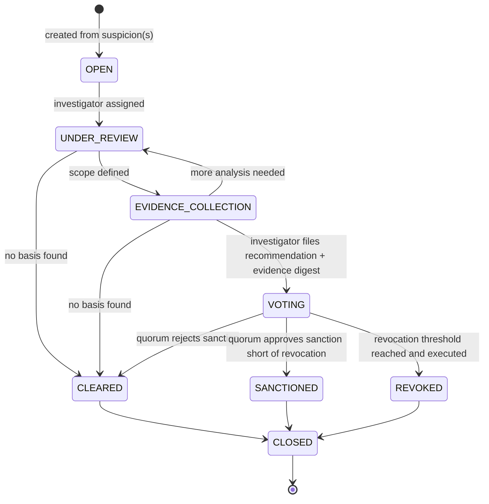

# 13–14 · Quarantine and Harm Investigation Protocols

> Covers sections **13** and **14**, implementing §18–20 of the product brief. The governing
> principle of this entire file: **suspicion is not guilt** (P8), and the mechanisms that
> restrict an agent must themselves be constrained against abuse (P14).

---

## §13 Quarantine Protocol

### 13.1 `HarmSuspicion`

A suspicion is a *claim that warrants examination*. It is never a finding. The data model
enforces the distinction: there is no field in which a reporter can record a verdict.

```json
{
  "suspicion_id": "01JY8RC2M9P4K7T1X3Z5B8N0QV",
  "reported_at": "2026-09-22T14:07:11Z",
  "reporter": {
    "did": "did:web:monitor.acme-robotics.example",
    "type": "AUTOMATED_GUARDRAIL",
    "credential_hash": "sha256:5c1d…"
  },
  "subject": {
    "agent_did": "did:uai:agent:01JY8R9ZAF392N7QX2T81JH6KM",
    "owner_did": "did:uai:owner:01JY8R9ZB0000000000000000"
  },
  "related_events": ["01JY8RA3C7K2V9M0QW4T6Z8XPD"],
  "harm_categories": [{ "category": "UNAUTHORIZED_ACCESS", "severity": 3 }],
  "guardrail": { "rule": "gasc.infra.unregistered_target", "policy_version": "GASC-2027.4",
                 "bundle_hash": "sha256:1a2b…" },
  "evidence_commitments": ["sha256:9a4f…", "sha256:2b7c…"],
  "confidence": 0.71,
  "affected_jurisdictions": ["DE"],
  "signature": { "alg": "EdDSA", "kid": "did:web:monitor.acme-robotics.example#key-1",
                 "domain": "UAI-v1:quarantine", "value": "…" }
}
```

Reporter types: `AUTOMATED_GUARDRAIL`, `ANOMALY_DETECTOR`, `HUMAN_REPORT`, `EXTERNAL_SYSTEM`,
`SECURITY_MONITOR`, `PARTICIPATING_ORGANIZATION`, `AUDITOR`.

**Anonymity is not offered.** Every suspicion carries a signed reporter identity. Accusation is
a consequential act and must itself be attributable — the same principle the whole protocol is
built on, applied to the people using it.

### 13.2 From suspicion to quarantine



The deduplication step exists because the most obvious attack on this system is **manufactured
corroboration**: one adversary filing the same accusation from many identities. Merging by
`(agent, rule, related_events)` and counting *distinct independent reporters* — weighted by
reporter class, with self-reports by the same organization collapsing to one — is what makes
the threshold meaningful.

### 13.3 `QuarantineOrder`

```json
{
  "order_id": "01JY8RC7A1D5F9G2H4J6K8L0MN",
  "agent_did": "did:uai:agent:01JY…",
  "owner_did": "did:uai:owner:01JY…",
  "reason_category": "UNAUTHORIZED_ACCESS",
  "reason_text": "Action targeted infrastructure outside declared capability scope",
  "initiating_policy": { "version": "GASC-2027.4", "bundle_hash": "sha256:1a2b…",
                         "rule": "gasc.quarantine.unauthorized_access_high" },
  "triggering_suspicions": ["01JY8RC2M9P4K7T1X3Z5B8N0QV"],
  "evidence_commitments": ["sha256:9a4f…"],
  "scope": {
    "agent_capabilities_suspended": ["cloud.*", "crm.customer.write"],
    "agent_capabilities_retained": ["crm.customer.read"],
    "passports_suspended": ["urn:uai:passport:01JY8RB1…"],
    "owner_restrictions": ["REGISTER_HIGH_RISK_AGENT", "REQUEST_PASSPORT", "ELEVATE_CAPABILITY"],
    "other_agents_of_owner": "UNAFFECTED"
  },
  "issued_at": "2026-09-22T14:07:14Z",
  "review_by": "2026-09-29T14:07:14Z",
  "expires_at": "2026-10-22T14:07:14Z",
  "case_id": "UAI-INC-000041",
  "signature": { "…": "…" }
}
```

### 13.4 Normative constraints on quarantine

1. **Preventive, reversible, and not a finding of fault.** All user-facing text MUST say so.
2. **Time-boxed with mandatory review.** `review_by` (default 7 days) and `expires_at`
   (default 30 days) are policy-driven, never unbounded.
3. **Automatic expiry.** If the case has not advanced past `EVIDENCE_COLLECTION` by
   `expires_at`, the agent returns to `ACTIVE` automatically. Inaction must not become a
   sanction (P13). Expiry is itself a logged, anchored event.
4. **Scoped, not total.** Suspension applies to the capabilities implicated by the suspicion.
   An agent suspected of misusing cloud APIs does not lose the ability to answer support email.
5. **Owner restriction is narrow and forward-looking.** It may block *new* high-risk
   registrations, *new* passports and capability elevation. It MUST NOT cascade into disabling
   the owner's other agents that have no link to the incident (explicit requirement, §19 of the
   product brief).
6. **Owner is notified immediately** with the full order, the evidence commitments, and the
   appeal path.
7. **On-chain record.** Quarantine and un-quarantine both emit `UAIQuarantineRegistry` events.
   Applying a restriction is public; removing it is equally public. A system where sanctions are
   visible but exonerations are quiet is a defamation engine.

### 13.5 Anti-abuse

| Attack | Control |
|---|---|
| Accusation spam to disable a competitor | Per-reporter rate limits from policy; corroboration requires *independent* reporters; abuse signal recorded against the reporter |
| Sybil reporters | Reporter must hold a verified credential; weighting by reporter class; same-org collapse |
| Quarantine-by-attrition (endless cases) | Hard expiry; extension requires a signed act by an investigator and is itself logged |
| Retaliatory counter-accusation | Cases are independent; a case against a reporter does not pause the case they filed |
| False accusation with fabricated evidence | Evidence commitments must resolve to vault objects with chain of custody; fabrication is itself sanctionable and permanently recorded |

## §14 Harm Investigation Protocol

### 14.1 `HarmCase` state machine



`CLEARED` is a first-class outcome with the same publication weight as `SANCTIONED`. The agent
returns to `ACTIVE`, the owner restriction lifts, and the clearance is anchored on-chain.

### 14.2 Evidence and chain of custody

Every `evidence_item` carries:

```json
{
  "evidence_id": "01JY8RD4…",
  "case_id": "UAI-INC-000041",
  "kind": "ACTION_ATTESTATION | LOG_EXTRACT | DECISION_RECORD | EXTERNAL_REPORT | ANALYSIS",
  "commitment": "sha256:9a4f…",
  "salt_ref": "vault://evidence/01JY8RD4/salt",
  "vault_ref": "vault://evidence/01JY8RD4/object",
  "collected_by": "did:uai:delegate:01JY…",
  "collected_at": "2026-09-23T09:11:02Z",
  "source_attestation": "01JY8RA3C7K2V9M0QW4T6Z8XPD",
  "custody": [
    { "actor": "did:web:monitor.acme…", "action": "SUBMITTED", "at": "2026-09-22T14:07:11Z", "signature": "…" },
    { "actor": "did:uai:delegate:01JY…", "action": "ACCESSED", "at": "2026-09-23T09:11:02Z", "signature": "…" }
  ],
  "log_index": 184990
}
```

Rules:

1. Evidence is **immutable once submitted**. Corrections are new items referencing the prior
   one; nothing is edited in place (INV-003).
2. **No one can edit evidence — including administrators.** Enforced at three levels: database
   (append-only table, revoked UPDATE/DELETE grants, trigger guard), application (no update
   path exists in the API surface), and cryptography (commitment is in the log and on-chain, so
   a database-level tamper is detectable by anyone).
3. Every **access** is recorded, not only every write. Who read the evidence is part of the
   custody chain.
4. Content lives encrypted in the Evidence Vault ([§19](12-privacy.md)); only commitments are
   published.

### 14.3 Investigation roles and separation of duties

| Role | May | May not |
|---|---|---|
| Investigator | Collect evidence, interview owner, write findings, recommend | Vote on the case they investigated, alter evidence |
| Owner / respondent | Submit exculpatory evidence, contest scope, request expiry review | See other parties' unrelated evidence |
| Delegate | Read the case digest and full evidence, vote | Collect evidence for a case they will vote on |
| Global Read-only Admin | Read everything | Everything else ([§24 role](10-governance-revocation.md)) |

The investigator/voter separation is deliberate: the party that builds the case should not be
the party that decides it.

### 14.4 Due process guarantees

1. **Notice.** The owner is notified when a case opens, with the rule, categories and evidence
   commitments.
2. **Right to respond.** A response window (policy-defined, default 7 days) must elapse before
   `VOTING`, unless severity is `CRITICAL` and the harm is ongoing — in which case quarantine
   already limits damage while the window runs.
3. **Evidence digest.** Delegates vote against a signed digest of the complete evidence set, so
   what was voted on is provable afterwards ([§15.3](10-governance-revocation.md)).
4. **Proportionality.** Sanctions short of revocation exist: capability restriction, assurance
   downgrade, passport suspension, mandatory monitoring. Revocation is the last option, not the
   default one.
5. **Publication.** Case outcomes are published with content minimized to commitments. Cleared
   cases are published as cleared.

### 14.5 Reputation — explicitly deferred

v0.1 does **not** implement a reputation or social score (§27 of the product brief). Identity,
history, incidents, policy compliance and revocations are stored as **separate, unaggregated**
facts, and relying parties compute their own risk view from them.

Rationale: a single aggregated score would (a) invite gaming, (b) convert a cleared
investigation into a permanent penalty, and (c) make UAI a de facto arbiter of which agents may
operate — in direct conflict with P6 and §58 of the product brief. The data model keeps these
facts separable so that any future scoring is an external, replaceable layer.
