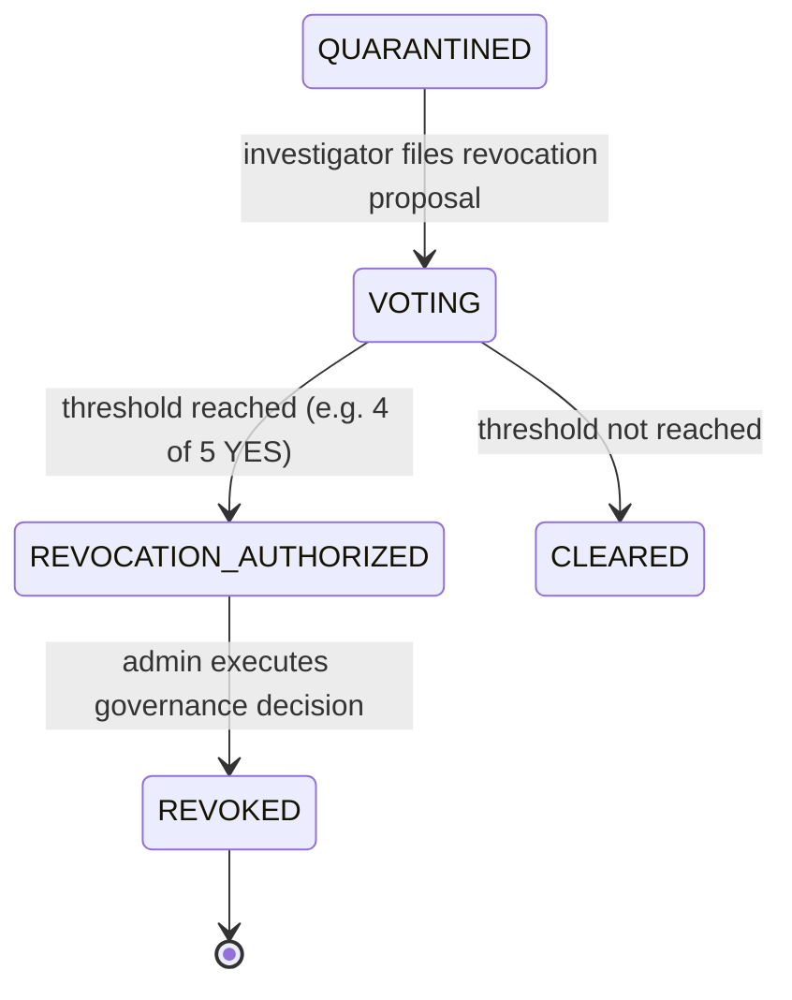
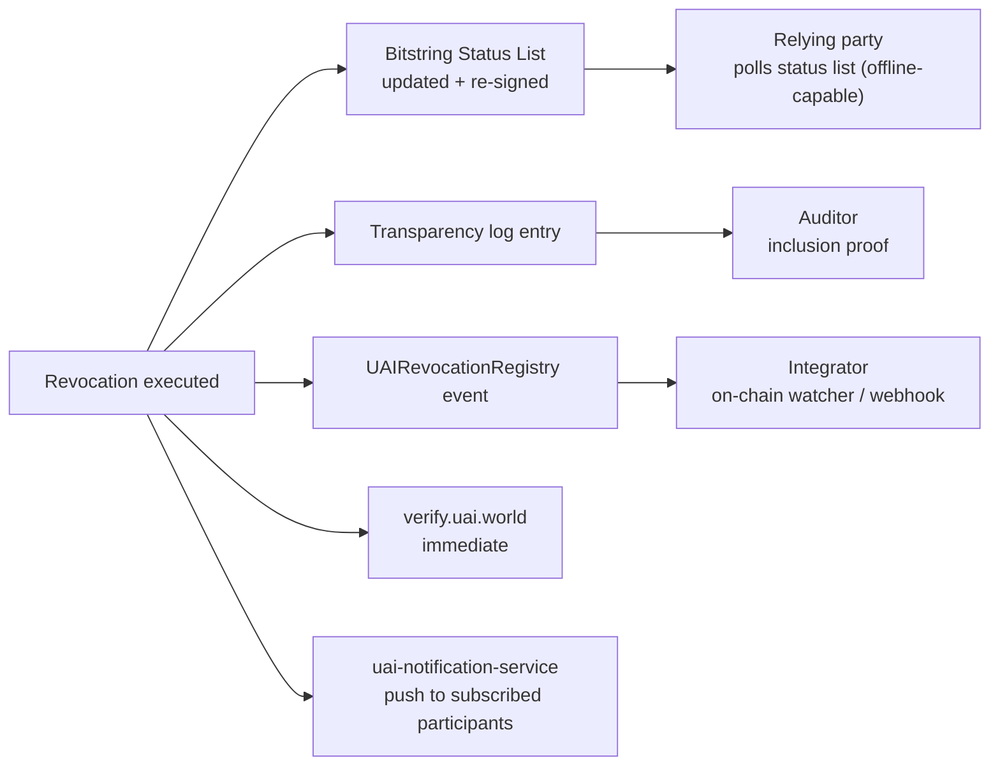

# 15–16 · Human Governance and Revocation Protocols

> Covers sections **15** and **16**, implementing §21–26 of the product brief: human-in-the-loop
> obligation, the Member Country Council, permanent revocation, the restricted role of the
> super administrator, and the distinction between revocation and historical deletion.

---

## §15 Human Governance Protocol

### 15.1 The rule that everything else defends

> **No AI system may decide a permanent revocation.** (INV-005)

AI may detect, classify, correlate, summarize and recommend. The transition
`REVOCATION_AUTHORIZED` requires signed votes from human delegates meeting a policy-defined
threshold. This is enforced in three independent places so that compromising one does not
defeat it:

1. **Application layer** — the governance service refuses to record a decision without valid
   delegate signatures.
2. **Smart contract layer** — `UAIGovernance` verifies delegate signatures on-chain against the
   registered delegate key set and the threshold from `UAIPolicyRegistry`. Application-layer
   compromise is therefore insufficient.
3. **Credential layer** — delegate signing keys are non-exportable WebAuthn authenticators
   requiring user verification. There is no software key for an automated process to steal and
   use.

### 15.2 Member Country Council

| Property | v0.1 value | Source |
|---|---|---|
| Council size | 5 (configurable) | `governance.rego` in the GASC bundle |
| Delegates per country | 1 primary + 1 alternate | Bundle |
| Revocation threshold | **4 of 5 YES** | Bundle — never hardcoded |
| Quorum for a vote to open | All eligible delegates notified + response window | Bundle |
| Vote values | `YES` / `NO` (abstention = no vote cast, recorded as `PENDING`) | Protocol |
| Tie / timeout | Vote fails; sanction is not applied; case may return to `EVIDENCE_COLLECTION` | Protocol |

Each delegate holds: a `MemberCountryCredential` (held by the country, delegating authority), a
`HumanDelegateCredential` (held by the person, time-bounded, revocable by the country), and a
hardware authenticator. **Bots, agents, delegated software and automated votes are prohibited**
and structurally impossible: the vote signature is a WebAuthn assertion requiring user
verification on a hardware authenticator.

### 15.3 Voting protocol

```mermaid
sequenceDiagram
    autonumber
    participant D as Delegate (human)
    participant B as Browser
    participant AUTH as Hardware authenticator
    participant GOV as uai-governance-service
    participant VOT as uai-voting-service
    participant TL as Transparency Log
    participant CH as UAIVoting (on-chain)

    D->>B: open Governance Case UAI-INC-000041
    B->>GOV: GET /governance/cases/{id} (session bound to WebAuthn login)
    GOV-->>B: case + evidence_digest + policy threshold + evidence access grants
    D->>B: reviews evidence; selects YES or NO; writes rationale
    B->>VOT: POST /governance/cases/{id}/vote/prepare {vote, rationale_hash}
    VOT->>VOT: build VoteStatement, compute digest = SHA-256("UAI-v1:vote" || 0x00 || jcs(stmt))
    VOT-->>B: {vote_statement, challenge = digest}
    B->>AUTH: navigator.credentials.get({challenge: digest, userVerification: "required"})
    AUTH-->>B: assertion {authenticatorData, clientDataJSON, signature}
    Note over AUTH,B: clientDataJSON contains the challenge, so the hardware<br/>signature is bound to the exact vote content
    B->>VOT: POST /governance/cases/{id}/vote {vote_statement, assertion}
    VOT->>VOT: verify assertion against registered delegate credential;<br/>verify challenge == recomputed digest; verify UV flag set;<br/>verify no prior vote by this delegate on this case
    VOT->>TL: append VoteStatement + assertion commitment
    VOT->>CH: castVote(caseId, delegateId, vote, signatureProof)
    VOT-->>B: 201 {vote_id, receipt, tally}
```

**Why the WebAuthn challenge is the vote digest.** A conventional design authenticates the human
with a passkey and then lets the server record whatever vote it likes. By making the vote digest
*the challenge*, the hardware signature covers the vote content itself: the resulting assertion
is non-repudiable evidence that this specific human approved this specific decision on this
specific case. It also means a compromised frontend cannot alter a vote — the digest shown to
the delegate is the digest signed by the device, and the delegate can verify it independently.

### 15.4 `VoteStatement`

```json
{
  "vote_id": "01JY8RE5…",
  "case_id": "UAI-INC-000041",
  "proposal": "PERMANENT_REVOCATION",
  "subject_agent_did": "did:uai:agent:01JY…",
  "evidence_digest": "sha256:3e7b…",
  "policy": { "version": "GASC-2027.4", "bundle_hash": "sha256:1a2b…", "threshold": "4-of-5" },
  "delegate": { "did": "did:uai:delegate:01JY…", "country": "DE",
                "credential_hash": "sha256:8d1a…" },
  "vote": "YES",
  "rationale_hash": "sha256:c4f9…",
  "cast_at": "2026-09-25T10:14:22Z",
  "nonce": "b17e…"
}
```

`evidence_digest` pins what was in front of the delegate. If evidence is added afterwards, the
digest changes and prior votes are marked `STALE_EVIDENCE`; policy decides whether a re-vote is
required. Votes on evidence nobody can reconstruct are worthless, so this field is mandatory.

### 15.5 Vote integrity rules

1. **One vote per delegate per proposal.** Enforced by unique constraint and by contract.
2. **No silent modification.** If the governance policy permits changing a vote, the change is a
   **new signed statement** superseding the prior one; both remain in the record with an explicit
   supersession link (§44 of the product brief).
3. **No proxy voting.** The assertion must come from the delegate's registered authenticator with
   user verification set.
4. **Tally is derived, never stored as truth.** The authoritative tally is recomputed from the
   signed statements; the cached counter is a view.
5. **Abstention is visible.** `PENDING` is displayed as `PENDING`, never folded into `NO`.
6. **Commit-reveal is a v0.2 option.** Open voting in v0.1 makes the process transparent but
   allows bandwagon effects; a commit-reveal variant (`H(vote‖salt)` first, reveal after close)
   is specified as an optional mode and flagged in the roadmap.

## §16 Revocation Protocol

### 16.1 Sequence



### 16.2 `RevocationDecision` and the governance proof

```json
{
  "decision_id": "01JY8RF6…",
  "case_id": "UAI-INC-000041",
  "subject_agent_did": "did:uai:agent:01JY…",
  "proposal": "PERMANENT_REVOCATION",
  "policy": { "version": "GASC-2027.4", "bundle_hash": "sha256:1a2b…", "threshold": "4-of-5" },
  "evidence_digest": "sha256:3e7b…",
  "tally": { "YES": 4, "NO": 1, "PENDING": 0 },
  "votes": [
    { "vote_id": "01JY8RE5…", "delegate_did": "did:uai:delegate:01JY…", "country": "AR",
      "vote": "YES", "assertion_commitment": "sha256:…" },
    { "…": "… 4 more …" }
  ],
  "authorized_at": "2026-09-25T11:02:00Z",
  "governance_proof": "sha256:f01c…",
  "status": "AUTHORIZED"
}
```

The `governance_proof` is the hash of the canonical bundle `{case_id, proposal, evidence_digest,
policy, all vote statements with assertions}`. It is the object the smart contract verifies. It
is what makes the next section possible.

### 16.3 The Global Read-only Admin — §24 of the product brief

```text
Role: GLOBAL_READONLY_ADMIN
```

| May read | Identities, statuses, events, cases, passports, policies, ledger records, votes, audit trail |
|---|---|
| **May write** | **Exactly one operation: `EXECUTE_AUTHORIZED_REVOCATION`** |
| May not | Create/edit agents · modify owners · issue passports · modify policies · touch evidence · quarantine or un-quarantine · vote · alter tallies · write to the ledger outside this one call |

Preconditions checked **server-side and on-chain** before execution:

```text
1. HarmCase exists and is in state VOTING with a closed vote
2. RevocationDecision exists with status AUTHORIZED
3. Every referenced VoteStatement verifies against a registered delegate key
4. Delegate credentials were valid at cast time
5. Tally recomputed from signed statements meets the threshold in the policy bundle
6. governance_proof recomputes to the stored value
7. The admin supplies its own PoP signature over the decision_id
```

The admin **cannot choose the agent, the reason, the votes or any parameter** — the only input
is `decision_id`, and every consequence is already fixed by the governance proof. The UI reads:

```text
[ EXECUTE GOVERNANCE DECISION ]
```

never `DELETE AGENT`. The distinction is not cosmetic: it is the difference between an operator
enacting a collective decision and an operator exercising power.

```mermaid
sequenceDiagram
    participant ADM as Global Read-only Admin
    participant GOV as uai-governance-service
    participant CH as UAIRevocationRegistry
    participant IDS as uai-identity-service
    participant TL as Transparency Log

    ADM->>GOV: POST /revocations/{decision_id}/execute (WebAuthn PoP)
    GOV->>GOV: recompute tally + governance_proof from signed votes
    GOV->>CH: executeRevocation(caseId, agentId, governanceProof, votes[])
    CH->>CH: verify each delegate signature against on-chain delegate set
    CH->>CH: verify threshold from UAIPolicyRegistry
    CH-->>GOV: AgentRevoked(agentId, governanceProof)
    GOV->>IDS: status REVOKED; revoke credentials + passports (same transaction)
    IDS->>TL: append revocation event
    GOV-->>ADM: 200 {status: REVOKED, tx, receipt}
```

If the contract rejects the proof, the execution fails and the attempt is recorded as an audit
event. **A malicious administrator with full database access still cannot revoke an agent**,
because the authority lives in delegate signatures verified by the contract, not in a row the
admin can edit (P6, §58 of the product brief).

### 16.4 Revocation is not deletion — §25 of the product brief

Three distinct concepts, never conflated:

| Concept | Effect | Mechanism |
|---|---|---|
| **Logical revocation** | Identity ceases to be valid going forward | `status = REVOKED`, status list bit set, on-chain event |
| **Privacy deletion** | Specific personal data destroyed when law requires | Evidence Vault crypto-shredding: destroy salt + data key ([§7.3](04-cryptography.md)) |
| **Historical commitment** | The record that these events happened survives forever | Hash chain + log + anchor, which contain no content |

```sql
-- correct
UPDATE agents SET status = 'REVOKED', revoked_at = now() WHERE id = $1;
-- forbidden, and prevented by grants and triggers
DELETE FROM agents WHERE id = $1;
```

A revoked identity keeps its full history, and its attestations remain verifiable forever — that
is the point. Deleting a revoked agent would destroy exactly the evidence the revocation was
based on.

### 16.5 Propagation: how the world learns



Four independent propagation paths exist because each fails differently: the status list works
offline but is periodic; the verify endpoint is instant but centralized; the chain watcher is
decentralized but has finality latency; notifications are push but require subscription.

### 16.6 What revocation actually means — §26 of the product brief

> **Revocation means that organizations participating in UAI will no longer honor this
> identity's credentials.**

It does **not** mean, and UAI must never imply, that:

- the agent's code stops running;
- the software is deleted from any machine;
- the owner is prevented from operating it outside the ecosystem;
- any state has enforced anything.

A protocol cannot reach into a disconnected computer. What it can do is make the identity
worthless *inside* the ecosystem: credential rejected, passport void, capabilities unrecognized,
attestations refused, and every participant able to verify all of that independently.

Stating this plainly is a design requirement, not a disclaimer. A system that promised a global
kill switch would be making a claim it cannot keep, and the first time that became obvious it
would take the credibility of everything else with it. UAI's claim is narrower and true:

> *Every action from this identity, before and after revocation, is attributable and
> independently verifiable — and inside this ecosystem, this identity no longer opens any door.*

### 16.7 Post-revocation behavior

Any presentation of a revoked credential returns:

```http
HTTP/1.1 403 Forbidden
Content-Type: application/problem+json

{
  "type": "https://uai.world/problems/identity-revoked",
  "title": "UAI_IDENTITY_REVOKED",
  "status": 403,
  "detail": "Identity did:uai:agent:01JY… was revoked by governance decision 01JY8RF6…",
  "case_id": "UAI-INC-000041",
  "revoked_at": "2026-09-25T11:04:31Z",
  "governance_proof": "sha256:f01c…",
  "verify": "https://verify.uai.world/uai:agent:01JY8R9ZAF392N7QX2T81JH6KM"
}
```

The error is *explanatory and verifiable*: it names the decision and hands the caller the proof
so the refusal itself can be checked. Attempted uses of revoked credentials are attested as
events — they are a useful signal about where an agent is still deployed.
