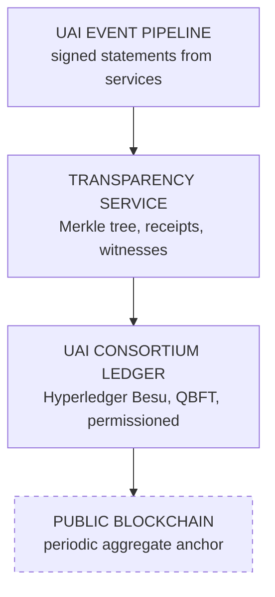
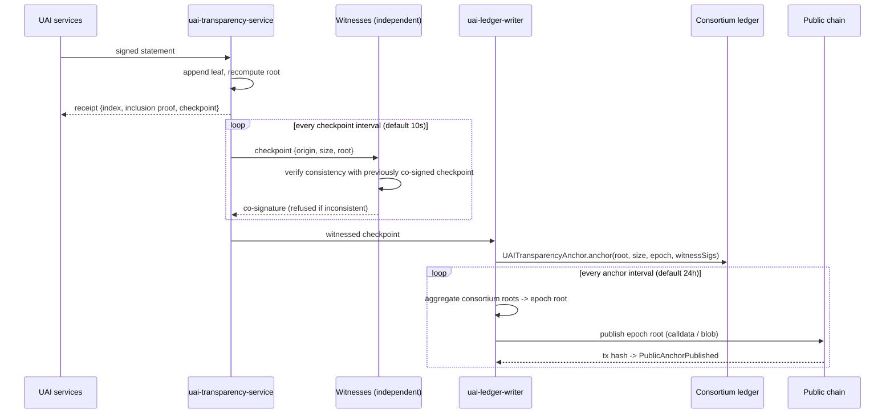

# 17–18 · Blockchain and Transparency Architecture

> Covers sections **17** and **18**, implementing §13–14 and §35 of the product brief.

---

## 17.1 Why two layers instead of one

| Layer | Answers | Fails at |
|---|---|---|
| **Transparency log** (Merkle, append-only) | "Did this exact statement exist at this position, and is the log consistent with its past?" | An operator serving different views to different verifiers (split view) |
| **Consortium ledger** (permissioned EVM) | "Do independent organizations agree on this checkpoint, and is it final?" | Throughput, privacy, cost if used as storage |
| **Public chain anchor** | "Is this history pinned to a system no consortium member controls?" | Cost and latency if used per-event |

Each layer covers the previous one's blind spot. Witnesses fix the log's split-view problem;
consensus fixes the witness-collusion problem; the public anchor fixes the consortium-collusion
problem. That is the entire argument for the stack.



## 17.2 Consortium ledger

| Parameter | Value (MVP) | Production target |
|---|---|---|
| Client | Hyperledger Besu | Besu |
| Consensus | QBFT (BFT, immediate finality) | QBFT |
| Validators | 4 local nodes (`3f+1, f=1`) | 1 per member organization/country, ≥ 13 |
| Block period | 2 s | 2–5 s |
| Chain ID | 13370 (dev) | assigned |
| Gas | Free gas (permissioned) | Free gas, quota per member |
| Finality | Immediate (no reorgs under BFT) | Immediate |

QBFT is chosen over PoA/Clique specifically because **immediate finality removes reorg
handling** from the accountability path. With Clique, a checkpoint could be reorganized out, and
"this event was anchored" would be a probabilistic statement. Under QBFT it is not.

Validator set changes are themselves on-chain governance transactions, so the answer to "who was
a validator when this was anchored" is auditable.

### 17.2.1 What goes on-chain — and what never does

**On-chain (commitments only):**
identity commitments · credential hashes · policy bundle hashes · action commitment roots ·
Merkle checkpoints · quarantine and un-quarantine events · passport issuance and revocation
hashes · votes (as signature proofs) · governance decisions · revocations · validator set
changes.

**Never on-chain, at any severity, for any reason:**
prompts · conversations · documents · personal data · secrets · tokens · API keys · evidence
content · IP addresses · names · email addresses · unsalted hashes of low-entropy values.

The last item is the subtle one: `SHA-256("alice@example.com")` is personal data in practice,
because it is recoverable by dictionary attack. UAI's salted commitments ([§7.3](04-cryptography.md))
exist precisely so that this class of mistake is impossible by construction. CI enforces it: a
schema check rejects any contract call parameter not matching `^0x[0-9a-f]{64}$` or an
enumerated type.

## 17.3 Smart contracts

| Contract | Responsibility | Key events |
|---|---|---|
| `UAIIdentityRegistry` | Identity + credential + passport commitments, status | `AgentRegistered`, `IdentityUpdated`, `PassportRecorded`, `PassportRevoked` |
| `UAIPolicyRegistry` | GASC bundle hashes, version chain, thresholds | `PolicyRegistered`, `PolicyActivated` |
| `UAITransparencyAnchor` | Merkle checkpoint anchoring + epoch tracking | `CheckpointAnchored`, `PublicAnchorPublished` |
| `UAIQuarantineRegistry` | Quarantine orders and releases | `AgentQuarantined`, `AgentUnquarantined`, `OwnerRestricted`, `OwnerRestrictionLifted` |
| `UAIGovernance` | Cases, proposals, delegate set, thresholds | `CaseOpened`, `ProposalCreated`, `DelegateRegistered`, `ThresholdUpdated` |
| `UAIVoting` | Vote recording + signature verification | `VoteCast`, `VoteSuperseded`, `QuorumReached` |
| `UAIRevocationRegistry` | Authorized revocation execution | `RevocationAuthorized`, `AgentRevoked` |

```solidity
// Illustrative core of UAIRevocationRegistry — the invariant made structural.
function executeRevocation(
    bytes32 caseId,
    bytes32 agentId,
    bytes32 governanceProof,
    Vote[] calldata votes
) external onlyExecutor {
    require(!revoked[agentId], "UAI: already revoked");
    require(governance.proposalState(caseId) == State.Authorized, "UAI: not authorized");

    uint256 yes;
    uint256 threshold = policy.revocationThreshold();      // from UAIPolicyRegistry, not a constant
    bytes32 seen;
    for (uint256 i = 0; i < votes.length; i++) {
        require(governance.isRegisteredDelegate(votes[i].delegateId), "UAI: unknown delegate");
        require(!_dup(seen, votes[i].delegateId), "UAI: duplicate delegate");
        require(_verifyVote(caseId, governanceProof, votes[i]), "UAI: bad signature");
        if (votes[i].value) yes++;
        seen = keccak256(abi.encodePacked(seen, votes[i].delegateId));
    }
    require(yes >= threshold, "UAI: threshold not met");

    revoked[agentId] = true;
    emit AgentRevoked(agentId, governanceProof);
}
```

`onlyExecutor` grants the Global Read-only Admin the right to *submit* the transaction — not the
right to decide it. Every consequential parameter is verified against delegate signatures and a
threshold that lives in the policy registry. This is INV-005 and INV-010 expressed as code that
no application-layer compromise can bypass.

Contracts are developed with Foundry, tested with fuzzing and invariant tests, and deployed
behind a minimal, governance-gated proxy so that a bug can be fixed without losing history.

### 17.3.1 The CI gate for INV-007 and INV-008

The check named in §17.2.1 is implemented against the **compiled ABIs**, which are committed to
`spec/contracts/` as specification artifacts. Two consequences follow, both intended: a third
party integrates against a published surface rather than against our build directory, and a
change to that surface appears as a reviewable diff instead of at deploy time.

The rule: every parameter and return value of every function, constructor, event and error must
be `bytes32`, `uintN`, `intN`, `bool`, `address`, or a tuple or array of those.

Absent by design: `string`, dynamic `bytes`, and every `bytesN` other than 32. Those are the
shapes that can carry a prompt, a document or an email address. A code-review gate would catch
most of that most of the time; making the shapes unspellable catches all of it every time.

`address` is allowed because access control needs it and an on-chain account is not personal
data in the sense §17.2.1 is about. `uint8` covers enums, which is how Solidity encodes them.

### 17.3.2 Two properties worth naming

**The quorum is not a constant.** `UAIRevocationRegistry` reads `revocationThreshold()` and
`minCountries()` from `UAIPolicyRegistry` on every call. A threshold compiled into the
revocation contract could only be changed by redeploying it, which would put a governance
parameter beyond the reach of governance.

**Signature malleability is rejected.** Every ECDSA signature has a second, equally valid form
with `s` in the upper half of the curve order. Accepting both would let one delegate be counted
twice under two spellings of the same vote, so `UAIVoting` refuses the non-canonical form.

## 17.4 Anchoring pipeline



**Witness co-signing is the mechanism that makes a split view impossible to hide.** A log
operator attempting to show verifier A one history and verifier B another must obtain witness
signatures for two inconsistent checkpoints; an honest witness refuses because it checks
consistency against what it already signed, and the refusal is itself evidence.

`PublicAnchorAdapter` is a pluggable interface (`ethereum-l1`, `base`, `arbitrum`, `bitcoin-ots`,
`noop-dev`). The MVP ships `noop-dev` plus a functioning local EVM target, so the anchoring path
is exercised end-to-end without spending money, and switching to a real public chain is a
configuration change, not a redesign.

**`noop-dev` returns an error, not an anchor.** This is the one detail of the adapter worth
stating normatively: an adapter that publishes nowhere MUST fail, and MUST NOT return a
plausible-looking transaction identifier. A development build that fabricated one would make
receipts claim durability nobody provided, and the claim would be indistinguishable from a real
one until somebody went looking for the transaction. False evidence is worse than absent
evidence, because absent evidence is noticed.

A deployment that names an adapter which is not built MUST refuse to start rather than falling
back to `noop-dev`. Silently downgrading would leave an operator believing they publish a public
anchor when they do not, which is exactly the belief this layer exists to make checkable.

## 18.1 Transparency service

Model: **SCITT-style** — Signed Statement → registered → Transparent Statement + Receipt.

| Object | Definition |
|---|---|
| **Signed Statement** | Any UAI object signed by its originator (attestation, decision, vote, credential, DID doc version, quarantine order) |
| **Entry** | `leaf = SHA-256(0x00 ‖ jcs(signed_statement))` at index `i` |
| **Checkpoint** | `{origin, size, root}` signed by the log and co-signed by ≥ W witnesses |
| **Receipt** | `{index, inclusion_proof, checkpoint, witness_signatures}` |
| **Transparent Statement** | The statement plus its receipt — self-contained and offline-verifiable |

### 18.1.1 Receipt

```json
{
  "log_origin": "uai.world/log/1",
  "log_index": 184213,
  "leaf_hash": "sha256:7a1c…",
  "checkpoint": { "size": 184300, "root": "sha256:9f2c…", "timestamp": "2026-09-22T14:02:05Z" },
  "inclusion_proof": ["sha256:1b…", "sha256:c4…", "sha256:8e…"],
  "log_signature": { "alg": "ES256", "kid": "did:web:log.uai.world#key-1", "value": "…" },
  "witness_signatures": [
    { "witness": "witness-de", "value": "…" },
    { "witness": "witness-jp", "value": "…" }
  ],
  "anchor": { "chain_id": 13370, "tx": "0x…", "block": 8829112, "epoch": 412 }
}
```

A verifier holding a Transparent Statement needs **no UAI service at all** for steps 1–6 of the
verification algorithm ([§10.9](06-action-attestation.md)). That is the design goal: evidence
that survives the disappearance of its issuer.

### 18.2 Guarantees and limits

Provable:
1. The statement existed at the time of the checkpoint (inclusion proof).
2. The log has not been rewritten (consistency proof).
3. Independent witnesses saw the same history (co-signatures).
4. The history is pinned in a system the operator does not control (anchor).

Not provable, and never claimed:
1. That the statement is **true** — the log records what was said, not what happened.
2. That no statement was **withheld** — an actor that never submits an event leaves no trace. UAI
   detects *gaps* in a chain (`sequence` holes, dangling `previous_event_hash`), which is the
   closest achievable approximation.
3. That the signer was not coerced.

### 18.3 Operational parameters

| Parameter | MVP | Production target |
|---|---|---|
| Checkpoint interval | 10 s | 1–10 s |
| Witness count `W` | 2 (local, simulated) | ≥ 3 independent operators, `W` from policy |
| Anchor interval (consortium) | every checkpoint | batched, ≤ 60 s |
| Public anchor interval | disabled (`noop-dev`) | 24 h |
| Log sharding | single tree | per-year epochs with cross-epoch consistency |
| Retention | indefinite for commitments | indefinite (commitments contain no content, so retention is cheap and lawful) |

### 18.4 Failure and recovery

| Failure | Detection | Response |
|---|---|---|
| Log unavailable | Services buffer signed statements | Statements retain signatures and order; flushed on recovery with divergence recorded |
| Log corruption | Consistency proof fails against witnessed checkpoint | New epoch from last good checkpoint; corrupted range marked; incident published |
| Witness offline | Co-signature count below `W` | Checkpoint marked `UNDERWITNESSED`; verifiers see reduced assurance rather than a silent downgrade |
| Ledger unavailable | Anchor queue depth grows | Log keeps operating; events are `VERIFIED_UNANCHORED` until the queue drains |
| Validator collusion > f | Conflicting finalized state | Public anchor divergence exposes it; this is the failure the public anchor exists for |
