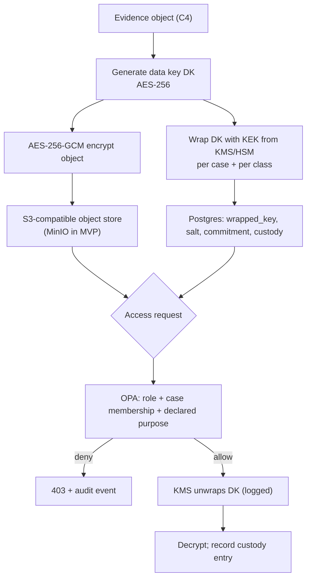

# 19 · Privacy Model

> Covers section **19**, implementing §28 of the product brief: privacy by design, the Evidence
> Vault, and the rule that the ledger never becomes a public database of personal information.

---

## 19.1 Data classification

Every field in every schema carries a classification. It determines where the value may live.

| Class | Examples | May be on-chain | May be in the log | May be in Postgres | May be in the vault |
|---|---|---|---|---|---|
| **C0 Public** | UAI-ID, DID, status, policy version, capability names | ✅ | ✅ | ✅ | ✅ |
| **C1 Commitment** | Salted commitments, Merkle roots, credential hashes | ✅ | ✅ | ✅ | ✅ |
| **C2 Operational** | Timestamps, sequence numbers, decision outcomes, rule IDs | ❌ | ✅ | ✅ | ✅ |
| **C3 Confidential** | Owner contact, org legal details, delegate identity, rationale text | ❌ | ❌ | ✅ (encrypted columns) | ✅ |
| **C4 Restricted** | Action inputs/outputs, evidence content, prompts, personal data, salts | ❌ | ❌ | ❌ | ✅ (encrypted, access-controlled) |

The rule an implementer can apply without thinking: **only C0 and C1 ever cross a boundary that
cannot be undone.** Everything reversible-sensitive lives where it can be deleted.

## 19.2 The seven principles, made concrete

| Principle | Implementation in UAI |
|---|---|
| **Data minimization** | The Universal Agent Identity Card carries only what verification requires. No prompts, no conversation content, no telemetry. `input_commitment` replaces input |
| **Selective disclosure** | Credentials issued additionally as SD-JWT VC: an agent can prove "assurance ≥ AL2 and capability granted" without revealing owner identity or the full capability set |
| **Pseudonymization** | The UAI-ID is opaque — no org, country, vendor or owner is derivable from the identifier itself |
| **Encrypted evidence** | Evidence Vault, envelope encryption, per-object data keys ([19.4](#194-evidence-vault)) |
| **Role-based access** | Distinct roles for investigator, delegate, owner, auditor, admin; every access logged in the custody chain |
| **Purpose limitation** | Every read of C3/C4 data requires a declared purpose recorded in the audit event; purposes are enumerated in policy |
| **Storage limitation** | Retention schedules per class (19.6); commitments outlive content by design |

## 19.3 Why salted commitments are a privacy control, not just an integrity one

```text
BAD :  commitment = SHA-256(content)
GOOD:  commitment = SHA-256("UAI-v1:commitment" || 0x00 || salt_32B || content)
```

With an unsalted hash, publishing the commitment of a low-entropy value publishes the value:
an adversary enumerates candidates and compares. Email addresses, amounts, customer IDs, account
numbers, yes/no answers and dates are all low-entropy. Since commitments go on-chain and on-chain
is forever, an unsalted commitment is an irreversible privacy leak.

The salt lives only in the vault, which is what makes two things simultaneously true:

1. The commitment can be published forever without leaking anything.
2. Anyone authorized can be shown `(salt, content)` and verify the match themselves.

## 19.4 Evidence Vault



Properties:

- **Per-object data keys.** Compromise of one object does not compromise another.
- **KEK per case and per class.** Destroying a case's KEK crypto-shreds all of its evidence at
  once, which is what a lawful erasure order in practice requires.
- **Every access is a custody event** — including reads by administrators and delegates.
- **Immutability.** Objects are write-once; corrections create new objects linked to the prior
  one (INV-003).
- **The vault is a separate failure domain** from the operational database, with separate
  credentials and separate network policy.

## 19.5 Erasure vs. immutability

The apparent contradiction — "records must be immutable" vs. "personal data must be erasable" —
is resolved structurally, not by policy exception:

```text
Immutable forever:   commitment, log index, inclusion proof, on-chain anchor   (contain no content)
Erasable on demand:  salt, ciphertext, data key, plaintext                     (contain the content)
```

Crypto-shredding destroys the salt and the wrapped data key. Afterwards:

- The content is unrecoverable by anyone, including the operator.
- The commitment remains valid, so the integrity of the chain and of every proof derived from it
  is untouched.
- The record that *an event occurred*, its time, its actors and its decision outcome survives —
  because that metadata is C1/C2, not C4.

A shredding operation is itself a logged, signed, anchored event. "This evidence was erased under
request R at time T by actor A" is part of the permanent record.

**The honest limit:** if a regulator demands erasure of the *fact that an event occurred*, and
that fact is in the chain and anchored, UAI cannot comply retroactively. That is disclosed to
every participant before registration. Minimizing what is committed in the first place is the
only real mitigation, and it is why the classification table above is enforced at schema level.

## 19.6 Retention

| Data | Retention | Rationale |
|---|---|---|
| Commitments, log entries, anchors (C0/C1) | Indefinite | No content; deleting them would destroy verifiability |
| Action attestation metadata (C2) | 7 years default, policy-configurable | Audit and legal requirements |
| Decision records (C2) | Life of the policy version + 7 years | Reproducibility of decisions |
| Evidence content (C4) | Case closure + policy window (default 2 years), then shred | Minimization |
| Action input/output content (C4) | Not retained by default; opt-in per capability, ≤ 90 days | Most deployments need the commitment, not the payload |
| Delegate rationale text (C3) | Life of the case + 7 years | Governance accountability |
| Access logs / custody (C2) | Same as the object they describe | An access record that outlives its object is useless; one that dies first is worse |

## 19.7 Cross-border data handling

UAI processes jurisdiction *labels*, not the underlying personal data. An attestation records
that an action affected subjects in `DE`; it does not record who they were. This keeps the
accountability layer out of scope for most data-transfer restrictions — the same design decision
that makes the ledger safe also makes the protocol deployable internationally.

Where the vault does hold C4 data, it is **regionally partitioned**: vault buckets and KEKs are
placed per region, and a case involving subjects in a region uses that region's vault. Evidence
does not cross a border merely because an investigator is elsewhere; access crosses the border,
under a logged purpose, while the bytes stay put.

## 19.8 What UAI deliberately does not collect

Stated explicitly so that adopters can verify it against the schema:

- No prompts, completions or conversation content.
- No model weights, system prompts or proprietary configuration.
- No end-user personal data beyond jurisdiction labels.
- No agent source code (only digests, when attested).
- No IP addresses in the accountability path (they may appear in short-lived transport logs,
  classified C3, retained 30 days).
- No behavioral profiling, no aggregated scoring ([§14.5](09-quarantine-investigation.md)).
