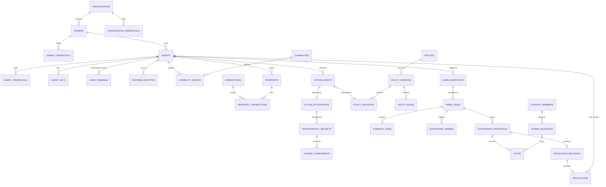

# 21 · Database Architecture

> Covers section **21**, implementing §33 of the product brief. PostgreSQL 16. Executable DDL
> lives in [`db/migrations/`](../../db/migrations/).

---

## 21.1 Design rules

1. **Nothing consequential is deleted.** Identity, event, evidence, vote and audit tables have
   `DELETE` and (where applicable) `UPDATE` revoked at the grant level, with trigger guards as a
   second layer. Lifecycle is expressed as status transitions (INV-006).
2. **Every consequential row carries its own proof.** `signature`, `signer_kid`, and where
   applicable `log_index` + `commitment` are columns, not metadata in a side table — a row that
   cannot be verified on its own is not evidence.
3. **The database is a cache of verifiable truth, not the source of it.** Any row can be
   reconstructed or checked against the transparency log. A DBA with full access can cause an
   outage, not a forgery.
4. **Content stays out.** C4 data lives in the Evidence Vault; tables hold commitments,
   wrapped keys and references ([§19.1](12-privacy.md)).
5. **Enums for state, check constraints for invariants.** Illegal states are unrepresentable
   where the type system can express it.
6. **Time-partitioning for volume.** `action_events` and `audit_events` partition monthly by
   `created_at`; ULID primary keys keep inserts append-friendly.

## 21.2 ERD



## 21.3 Table inventory

| Table | Purpose | Append-only | Notes |
|---|---|---|---|
| `organizations` | Legal entities | no (status) | `did` unique, `jurisdiction` FK |
| `owners` | Persons or entities responsible for agents | no (status) | `restriction_state` for `OWNER_RESTRICTED` |
| `owner_credentials` | VCs held by owners | **yes** | supersession by new row |
| `organization_credentials` | VCs held by orgs | **yes** | |
| `agents` | Core identity record | no (status only) | `DELETE` revoked; `uai_id`, `did` unique |
| `agent_credentials` | Identity/ownership/capability/safety VCs | **yes** | `credential_hash` unique |
| `agent_keys` | Key history with validity windows | **yes** | enables "valid at event time" verification |
| `agent_bindings` | BIND/UNBIND/REBIND events | **yes** | `continuity_proof` for rebind |
| `runtime_identities` | SPIFFE SVID bindings | **yes** | `spiffe_id`, `cert_hash`, `image_digest` |
| `capabilities` | Capability registry (from policy bundle) | no | `risk_class`, `min_assurance` |
| `capability_grants` | Grants to agents | **yes** | revocation = new row with `revoked_at` |
| `passports` | Passport credentials | no (state) | `credential_hash`, `policy_version` |
| `jurisdictions` | Region registry | no | ISO 3166 + groupings |
| `policies`, `policy_versions`, `policy_rules` | GASC bundles | **yes** (versions) | `bundle_hash`, `previous_policy_hash` |
| `policy_decisions` | Every PDP decision | **yes** | signed; referenced by attestations |
| `action_events` | Action records | **yes**, partitioned monthly | chain: `previous_event_hash`, `sequence` |
| `action_attestations` | Signed attestation payloads | **yes**, partitioned monthly | 1:1 with `action_events` |
| `transparency_receipts` | Log receipts | **yes** | `log_index` unique per log origin |
| `ledger_commitments` | On-chain anchors | **yes** | `tx_hash`, `block_number`, `epoch` |
| `harm_suspicions` | Suspicion reports | **yes** | signed reporter, dedup key |
| `harm_cases` | Investigations | no (state) | state machine enforced by trigger |
| `evidence_items` | Evidence commitments + custody | **yes**, UPDATE/DELETE revoked | INV-003 |
| `evidence_access_log` | Every read of evidence | **yes** | custody chain |
| `quarantine_orders` | Preventive restrictions | **yes** | `expires_at` drives auto-release job |
| `country_members` | Member countries | no (status) | |
| `human_delegates` | Appointed humans | no (status) | WebAuthn credential IDs |
| `governance_proposals` | Proposals per case | no (state) | `threshold_snapshot` |
| `votes` | Signed votes | **yes** | unique `(proposal_id, delegate_id, superseded_by IS NULL)` |
| `revocation_decisions` | Authorized decisions | **yes** | `governance_proof` |
| `revocations` | Executed revocations | **yes** | `executed_by`, `tx_hash` |
| `audit_events` | Every operation | **yes**, partitioned monthly | INV-003 applies to admins too |
| `idempotency_keys` | Request deduplication | n/a | TTL-expired |
| `nonces` | Replay cache | n/a | TTL-expired |

## 21.4 Key enumerations

```sql
CREATE TYPE agent_status AS ENUM (
  'UNREGISTERED','REGISTERED','VERIFIED','ACTIVE','UNBOUND',
  'QUARANTINED','REVOCATION_AUTHORIZED','REVOKED');

CREATE TYPE assurance_level AS ENUM ('UAI-AL0','UAI-AL1','UAI-AL2','UAI-AL3');

CREATE TYPE policy_decision_effect AS ENUM (
  'ALLOW','ALLOW_WITH_MONITORING','REQUIRE_HUMAN_APPROVAL','DENY','QUARANTINE');

CREATE TYPE harm_category AS ENUM (
  'PHYSICAL_HARM','CYBER_HARM','PRIVACY_HARM','FINANCIAL_HARM','ENVIRONMENTAL_HARM',
  'CRITICAL_INFRASTRUCTURE','FRAUD_OR_DECEPTION','UNAUTHORIZED_ACCESS','DATA_EXFILTRATION',
  'HUMAN_RIGHTS_RISK','SAFETY_SYSTEM_BYPASS','MALICIOUS_AUTONOMOUS_PROPAGATION');

CREATE TYPE case_state AS ENUM (
  'OPEN','UNDER_REVIEW','EVIDENCE_COLLECTION','VOTING','CLEARED','SANCTIONED','REVOKED','CLOSED');

CREATE TYPE passport_state AS ENUM (
  'REQUESTED','VALID','EXPIRED','SUSPENDED','QUARANTINED','REVOKED','DENIED');

CREATE TYPE vote_value AS ENUM ('YES','NO');
```

`harm_category` as an enum is a deliberate tension with "the taxonomy must never be a hardcoded
constant" (§16 of the product brief). Resolution: the enum is a **storage optimization
synchronized from the policy bundle by migration**, and the *semantics* — severity thresholds,
which categories trigger quarantine, how they map to decisions — live entirely in the bundle.
Adding a category is a bundle release plus a generated migration, never a code change. The
`policy_rules` table carries the authoritative mapping.

## 21.5 Integrity mechanisms in the schema

```sql
-- INV-002: an action can never exist without a signature
ALTER TABLE action_attestations
  ADD CONSTRAINT attestation_must_be_signed
  CHECK (signature IS NOT NULL AND signer_kid IS NOT NULL AND length(signature) > 0);

-- INV-009: a decision must always name its policy version and bundle hash
ALTER TABLE policy_decisions
  ADD CONSTRAINT decision_must_name_policy
  CHECK (policy_version IS NOT NULL AND bundle_hash ~ '^sha256:[0-9a-f]{64}$');

-- INV-003 / INV-006: evidence and identities are not editable or deletable
REVOKE UPDATE, DELETE ON evidence_items, action_events, action_attestations,
       votes, audit_events FROM uai_app;
REVOKE DELETE ON agents, harm_cases, revocations FROM uai_app;

CREATE OR REPLACE FUNCTION uai_reject_mutation() RETURNS trigger AS $$
BEGIN
  RAISE EXCEPTION 'UAI_APPEND_ONLY: % on % is forbidden', TG_OP, TG_TABLE_NAME
    USING ERRCODE = 'integrity_constraint_violation';
END $$ LANGUAGE plpgsql;

CREATE TRIGGER evidence_items_append_only
  BEFORE UPDATE OR DELETE ON evidence_items
  FOR EACH ROW EXECUTE FUNCTION uai_reject_mutation();

-- chain integrity: one successor per predecessor, per agent
CREATE UNIQUE INDEX action_events_chain_uq
  ON action_events (agent_id, previous_event_hash)
  WHERE previous_event_hash IS NOT NULL;

-- one live vote per delegate per proposal
CREATE UNIQUE INDEX votes_one_live_per_delegate
  ON votes (proposal_id, delegate_id) WHERE superseded_by IS NULL;
```

The chain uniqueness index is worth noting: it makes a **fork impossible to commit** within a
single database, which turns fork detection into a cross-instance and cross-log check rather
than an application-level race.

## 21.6 Indexing strategy

| Query | Index |
|---|---|
| Verify by UAI-ID (hottest path) | `agents (uai_id)` unique, covering `(status, assurance_level, owner_id)` |
| Agent timeline | `action_events (agent_id, sequence DESC)` |
| Chain head lookup | `action_events (agent_id, created_at DESC)` partial on latest partition |
| Action explorer by time | BRIN on `action_events (created_at)` — cheap on append-only partitions |
| Open cases by agent | `harm_cases (agent_id, state) WHERE state NOT IN ('CLOSED')` |
| Quarantine expiry sweep | `quarantine_orders (expires_at) WHERE released_at IS NULL` |
| Receipt lookup | `transparency_receipts (log_origin, log_index)` unique |
| Status list generation | `agents (status, updated_at)` |

## 21.7 Migrations

- Tool: `golang-migrate`, plain SQL, forward-only in production with explicit `down` for dev.
- Naming: `NNNN_description.up.sql` / `.down.sql`.
- Every migration is reviewed against INV-003/006: a migration that adds a `DELETE` path to a
  protected table fails CI.
- Seed data (`0002_seed_capabilities.up.sql`, `0003_seed_jurisdictions.up.sql`) is generated
  from the GASC bundle, never hand-written, so the database and the policy cannot drift.
