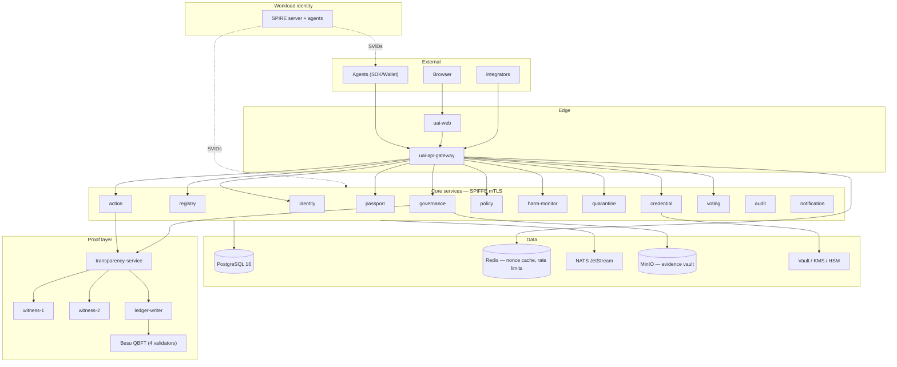

# 23 · Deployment Architecture

> Covers section **23**, implementing §29, §31–32 and §50 of the product brief.

---

## 23.1 Components

```text
uai-web                  Next.js frontend (verify, registry, explorer, governance)
uai-api-gateway          Public edge: mTLS, PoP verification, rate limits, routing (PEP)
uai-identity-service     DID documents, key lifecycle, resolution
uai-agent-registry       Registration, binding lifecycle, state machine
uai-credential-service   VC issuance, status lists, HSM/KMS signing
uai-passport-service     Passport issuance and verification
uai-action-service       Attestation ingestion, chain integrity, fork detection
uai-policy-service       OPA embedded; bundle verification; PDP
uai-harm-monitor         Anomaly detection, suspicion intake, deduplication
uai-quarantine-service   Quarantine orders, expiry sweep, owner restrictions
uai-governance-service   Cases, proposals, delegates, governance proofs
uai-voting-service       WebAuthn vote capture and verification
uai-evidence-vault       Encrypted evidence storage, custody, crypto-shredding
uai-transparency-service Merkle log, receipts, checkpoints, witness coordination
uai-ledger-writer        Batching, contract calls, anchor scheduling
uai-notification-service Webhooks and push to participants
uai-audit-service        Append-only audit event ingestion and query
```

## 23.2 Topology



## 23.3 Zero trust (§29)

| Control | Implementation |
|---|---|
| Mutual TLS everywhere | SPIFFE X.509-SVIDs; no plaintext hop, including inside the cluster |
| Short-lived credentials | SVID TTL 1 h (MVP) → 5 min; no static service passwords |
| Workload identity | SPIRE node + workload attestation (k8s SA, image digest) |
| Least privilege | Per-service DB roles with per-table grants; OPA authz on every internal gRPC method |
| Signed events | Every consequential inter-service message carries an originator signature |
| Key rotation | Automated for SVIDs; scheduled + emergency paths for persistent keys |
| Auditable authorization | Every allow/deny at every boundary produces an audit event |

No component trusts another because of network position. A compromised service reaches exactly
the data its own grants allow, and its actions are attributable to its own SVID.

## 23.4 Local development — Docker Compose first

The compose file grows phase by phase, and it only ever contains services that exist. A stack
declaring containers for unbuilt services would fail on the first `up` and would misrepresent
what the project actually runs.

**Shipping today** (`deploy/compose/docker-compose.yml`) — the infrastructure the implemented
phases need:

```text
postgres   PostgreSQL 16        schema + invariant guards (Phase 3)
redis      nonce replay cache, rate limits
nats       JetStream, durable inter-service events
minio      S3-compatible object store for the Evidence Vault
opa        policy decision engine, mounted against policy/
```

**Added as the phases land**, in this order:

| Added in | Services |
|---|---|
| Phase 4 | `uai-gateway`, `uai-identity`, `uai-registry`, `uai-credential`, `uai-action` |
| Phase 6 | `uai-policy` (OPA embedded rather than sidecar) |
| Phase 7 | `besu-1..4` (QBFT validators), `uai-ledger-writer`, `uai-transparency`, `witness-1`, `witness-2` |
| Phase 8 | `uai-web` |
| Phase 12 | `spire-server`, `spire-agent`, full observability profile |

Profiles keep the default path light: `docker compose up` brings what exists; `--profile full`
will add Vault, SPIRE and the observability stack once Phase 12 introduces them.

### 23.4.1 Make targets

The Makefile follows the same rule — a target exists only when it works:

```bash
make up          # start the infrastructure containers
make migrate     # apply the schema
make dev         # up + migrate
make test        # Go unit tests
make invariants  # assert that the forbidden operations fail
```

`make demo` (the ACME end-to-end scenario) and `make verify` (conformance vectors against a
running stack) arrive with Phases 10 and 2 respectively. **The "one command from clone to a
working demo" goal is a Phase 10 acceptance criterion, not a present-tense claim** — a protocol
nobody can run locally is a protocol nobody implements, which is why it is an explicit gate
rather than an aspiration.

## 23.5 Production — Kubernetes + SPIRE

| Concern | Approach |
|---|---|
| Orchestration | Kubernetes, one namespace per plane (identity / governance / proof / data) |
| Workload identity | SPIRE server (HA) + agent DaemonSet; registration entries by SA + image digest |
| Ingress | Envoy at the edge with mTLS passthrough for agent traffic |
| Secrets | Vault with KMS auto-unseal; issuer keys in HSM/CloudHSM, never in cluster |
| Database | PostgreSQL HA with PITR; separate instance for the evidence vault metadata |
| Ledger | Validators operated by **independent** member organizations — co-locating them would defeat the purpose |
| Witnesses | Independent operators in separate administrative domains |
| Multi-region | Regional vaults for data residency ([§19.7](12-privacy.md)); global read replicas for `verify` |

## 23.6 Observability

- **OpenTelemetry** traces across gateway → PDP → action → transparency → ledger, with the
  `decision_id` and `event_id` as span attributes so an incident can be reconstructed end to end.
- **Prometheus** SLIs: attestation p99 latency, PDP p99, log append latency, checkpoint age,
  anchor lag, witness co-signature ratio, quarantine sweep lag, verify endpoint cache hit rate.
- **Grafana** dashboards per plane; **Loki** for logs, with a hard rule that C3/C4 data never
  enters logs (enforced by a redaction middleware and a CI check on log statements).
- **Alerts that matter**: checkpoint age > 60 s, anchor lag > 5 min, witness count below `W`,
  fork detected, admin action executed, policy bundle signature failure, quarantine expiry sweep
  failing.

## 23.7 CI/CD (§50)

```mermaid
flowchart LR
    PR["Pull request"] --> L["lint + format"]
    L --> UT["unit tests"]
    UT --> IT["integration tests (compose)"]
    IT --> ST["security tests<br/>(INV negative tests)"]
    ST --> DEP["dependency scan"]
    DEP --> SAST["SAST"]
    SAST --> SEC["secret scanning"]
    SEC --> CON["container scan"]
    CON --> SBOM["SBOM generation"]
    SBOM --> SIGN["artifact signing (cosign)"]
    SIGN --> PROV["provenance attestation (SLSA)"]
    PROV --> DEPLOY["deploy"]
```



Additional gates specific to this system:

- **Invariant tests are blocking.** The INV-001…010 negative tests are not allowed to be skipped.
- **On-chain data check.** Any contract call argument that is not `bytes32`/enum/uint fails the
  build (INV-007/008).
- **Conformance vectors.** SDKs must reproduce `spec/test-vectors/` byte-for-byte.
- **Migration review.** A migration adding a `DELETE` grant on a protected table fails CI.
- **Policy bundle signature check** before any bundle is published.

## 23.8 Quality gate per phase (§57)

No phase is considered complete until each of these is explicitly answered in the phase's PR
description — not assumed:

`SECURITY` · `ARCHITECTURE` · `TESTING` · `OBSERVABILITY` · `DOCUMENTATION` · `PRIVACY` ·
`PERFORMANCE` · `INTEROPERABILITY` · `AUDITABILITY`
