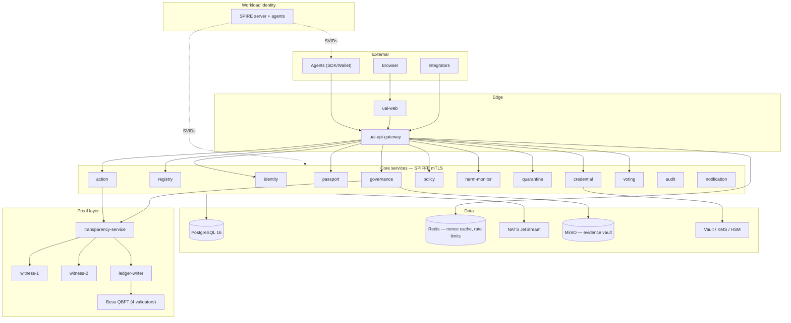

# 23 · Deployment Architecture

> Covers section **23**, implementing §29, §31–32 and §50 of the product brief.

---

## 23.1 Components

```text
uai-web                  Next.js frontend (verify, registry, explorer, governance)
uai-api-gateway          Public edge: mTLS, PoP verification, rate limits, routing (PEP)
uai-identity-service     DID documents, key lifecycle, resolution
uai-agent-registry       Registration, binding lifecycle, state machine
uai-credential-service   VC issuance, status lists, HSM/KMS signing
uai-passport-service     Passport issuance and verification
uai-action-service       Attestation ingestion, chain integrity, fork detection
uai-policy-service       OPA embedded; bundle verification; PDP
uai-harm-monitor         Anomaly detection, suspicion intake, deduplication
uai-quarantine-service   Quarantine orders, expiry sweep, owner restrictions
uai-governance-service   Cases, proposals, delegates, governance proofs
uai-voting-service       WebAuthn vote capture and verification
uai-evidence-vault       Encrypted evidence storage, custody, crypto-shredding
uai-transparency-service Merkle log, receipts, checkpoints, witness coordination
uai-ledger-writer        Batching, contract calls, anchor scheduling
uai-notification-service Webhooks and push to participants
uai-audit-service        Append-only audit event ingestion and query
```

## 23.2 Topology



## 23.3 Zero trust (§29)

| Control | Implementation |
|---|---|
| Mutual TLS everywhere | SPIFFE X.509-SVIDs; no plaintext hop, including inside the cluster |
| Short-lived credentials | SVID TTL 1 h (MVP) → 5 min; no static service passwords |
| Workload identity | SPIRE node + workload attestation (k8s SA, image digest) |
| Least privilege | Per-service DB roles with per-table grants; OPA authz on every internal gRPC method |
| Signed events | Every consequential inter-service message carries an originator signature |
| Key rotation | Automated for SVIDs; scheduled + emergency paths for persistent keys |
| Auditable authorization | Every allow/deny at every boundary produces an audit event |

No component trusts another because of network position. A compromised service reaches exactly
the data its own grants allow, and its actions are attributable to its own SVID.

## 23.4 Local development — rootless Podman first

**Reference runtime: rootless Podman.** Docker is supported on every target and must keep
working; the reasoning, the measured security comparison and — most of it — *why this was
decided in Phase 4 rather than after Phase 12* are in
[ADR-0001](../adr/0001-podman-rootless-runtime.md).

The short version: in this system the container runtime is not packaging. SPIRE derives a
workload's identity from what the runtime can attest about the process, and attestor selectors
are runtime-specific, so deferring the runtime choice means deferring the root of the workload
trust chain until after the code that depends on it exists.

The stack file grows phase by phase and only ever contains services that exist. A stack that
starts daemons nothing talks to misrepresents the system, and it is the first command a new
contributor runs.

**Shipping today** (`deploy/compose/compose.yaml`):

```text
postgres   PostgreSQL 16, pinned by manifest digest   schema + invariant guards (Phase 3)
```

That is the whole list. The nonce replay cache, the idempotency ledger and the event chain are
all PostgreSQL (`internal/store`); there is no message bus and no object store in the
implemented phases.

**Added as the phases land**, in this order:

| Added in | Services | Why not earlier |
|---|---|---|
| Phase 6 | `opa` | no policy bundle exists to serve yet |
| Phase 7 | `besu-1..4` (QBFT validators), `witness-1`, `witness-2` | nothing writes to a ledger or co-signs a checkpoint yet |
| Phase 8 | `uai-web` | — |
| Phase 10 | `uai-gateway` in-stack, for the ACME demo | the image exists now (`make image`); the demo wires it |
| Phase 12 | `spire-server`, `spire-agent`, observability profile | — |

Images are pinned by multi-arch manifest digest rather than by tag. A floating tag is an
unreviewed dependency update executed on every `up` (threat **T-07**), and it makes "works on
my machine" unfalsifiable.

### 23.4.1 Make targets

The Makefile follows the same rule — a target exists only when it works:

```bash
make runtime     # show the detected runtime, compose provider and image tags
make up          # start the infrastructure containers
make migrate     # apply the schema
make dev         # up + migrate + seed
make image       # build the gateway image (rootless, scratch-based, reproducible)
make test        # Go unit tests
make integration # throwaway PostgreSQL + store/API tests with -race + the invariants
make invariants  # assert that the forbidden operations fail
```

Every container target honours `CONTAINER=docker`. The throwaway integration database is not
pinned separately: `PG_IMAGE` is parsed out of `compose.yaml`, because asserting the invariants
against a different PostgreSQL than developers run is how a version-specific trigger behaviour
ships green and breaks on a laptop.

`make demo` (the ACME end-to-end scenario) arrives with Phase 10. **The "one command from clone
to a working demo" goal is a Phase 10 acceptance criterion, not a present-tense claim** — a
protocol nobody can run locally is a protocol nobody implements, which is why it is an explicit
gate rather than an aspiration.

### 23.4.2 Image construction

`deploy/containers/Containerfile.gateway` is the pattern every later service image follows:

| Property | How | Why |
|---|---|---|
| `FROM scratch` | static `CGO_ENABLED=0` binary, CA bundle and a passwd entry copied in | no shell and no package manager means command execution has nothing to execute; there is also no CVE feed for an empty filesystem |
| Reproducible | `-trimpath`, `-buildid=`, `-mod=readonly`, `podman build --timestamp=0` | a verifier that cannot rebuild the artifact it is asked to trust is taking our word for it |
| Non-root | `USER 65532:65532` with a real `/etc/passwd` entry | correct even on a runtime that does not map users itself |
| No secrets in context | `.containerignore` (`.dockerignore` is a symlink to it, so they cannot drift) excludes `.env`, `.keys/`, `*.pem` | anything copied into a layer is recoverable from the image even if a later stage deletes it |

The trade-off is accepted deliberately: you cannot `exec` a shell into this image to debug it.
That is the property, not a defect — it is why the gateway emits structured logs.

## 23.5 Production — Kubernetes + SPIRE

| Concern | Approach |
|---|---|
| Orchestration | Kubernetes, one namespace per plane (identity / governance / proof / data) |
| Container runtime | CRI-O or containerd; images are OCI and built rootless ([ADR-0001](../adr/0001-podman-rootless-runtime.md)) — no image in this system requires a Docker-specific build feature |
| Workload identity | SPIRE server (HA) + agent DaemonSet; registration entries by SA + image digest. Selectors are runtime-specific, which is why the runtime was fixed before the SPIFFE integration rather than after |
| Ingress | Envoy at the edge with mTLS passthrough for agent traffic |
| Secrets | Vault with KMS auto-unseal; issuer keys in HSM/CloudHSM, never in cluster |
| Database | PostgreSQL HA with PITR; separate instance for the evidence vault metadata |
| Ledger | Validators operated by **independent** member organizations — co-locating them would defeat the purpose |
| Witnesses | Independent operators in separate administrative domains |
| Multi-region | Regional vaults for data residency ([§19.7](12-privacy.md)); global read replicas for `verify` |

## 23.6 Observability

- **OpenTelemetry** traces across gateway → PDP → action → transparency → ledger, with the
  `decision_id` and `event_id` as span attributes so an incident can be reconstructed end to end.
- **Prometheus** SLIs: attestation p99 latency, PDP p99, log append latency, checkpoint age,
  anchor lag, witness co-signature ratio, quarantine sweep lag, verify endpoint cache hit rate.
- **Grafana** dashboards per plane; **Loki** for logs, with a hard rule that C3/C4 data never
  enters logs (enforced by a redaction middleware and a CI check on log statements).
- **Alerts that matter**: checkpoint age > 60 s, anchor lag > 5 min, witness count below `W`,
  fork detected, admin action executed, policy bundle signature failure, quarantine expiry sweep
  failing.

## 23.7 CI/CD (§50)

```mermaid
flowchart LR
    PR["Pull request"] --> L["lint + format"]
    L --> UT["unit tests"]
    UT --> IT["integration tests (compose)"]
    IT --> ST["security tests<br/>(INV negative tests)"]
    ST --> DEP["dependency scan"]
    DEP --> SAST["SAST"]
    SAST --> SEC["secret scanning"]
    SEC --> CON["container scan"]
    CON --> SBOM["SBOM generation"]
    SBOM --> SIGN["artifact signing (cosign)"]
    SIGN --> PROV["provenance attestation (SLSA)"]
    PROV --> DEPLOY["deploy"]
```



Additional gates specific to this system:

- **Both runtimes are exercised.** The integration job runs once under rootless Podman and once
  under Docker. A reference implementation that only runs on the runtime its authors happen to
  prefer has quietly narrowed the protocol, and we are asking other implementers not to do that.
- **Images are built rootless** (Podman/Buildah — no daemon in CI) and the build is repeated to
  confirm the image id is identical. A non-reproducible build makes the signature and the SBOM
  attest to something nobody else can reconstruct.
- **Invariant tests are blocking.** The INV-001…010 negative tests are not allowed to be skipped.
- **On-chain data check.** Any contract call argument that is not `bytes32`/enum/uint fails the
  build (INV-007/008).
- **Conformance vectors.** SDKs must reproduce `spec/test-vectors/` byte-for-byte.
- **Migration review.** A migration adding a `DELETE` grant on a protected table fails CI.
- **Policy bundle signature check** before any bundle is published.

## 23.8 Quality gate per phase (§57)

No phase is considered complete until each of these is explicitly answered in the phase's PR
description — not assumed:

`SECURITY` · `ARCHITECTURE` · `TESTING` · `OBSERVABILITY` · `DOCUMENTATION` · `PRIVACY` ·
`PERFORMANCE` · `INTEROPERABILITY` · `AUDITABILITY`
