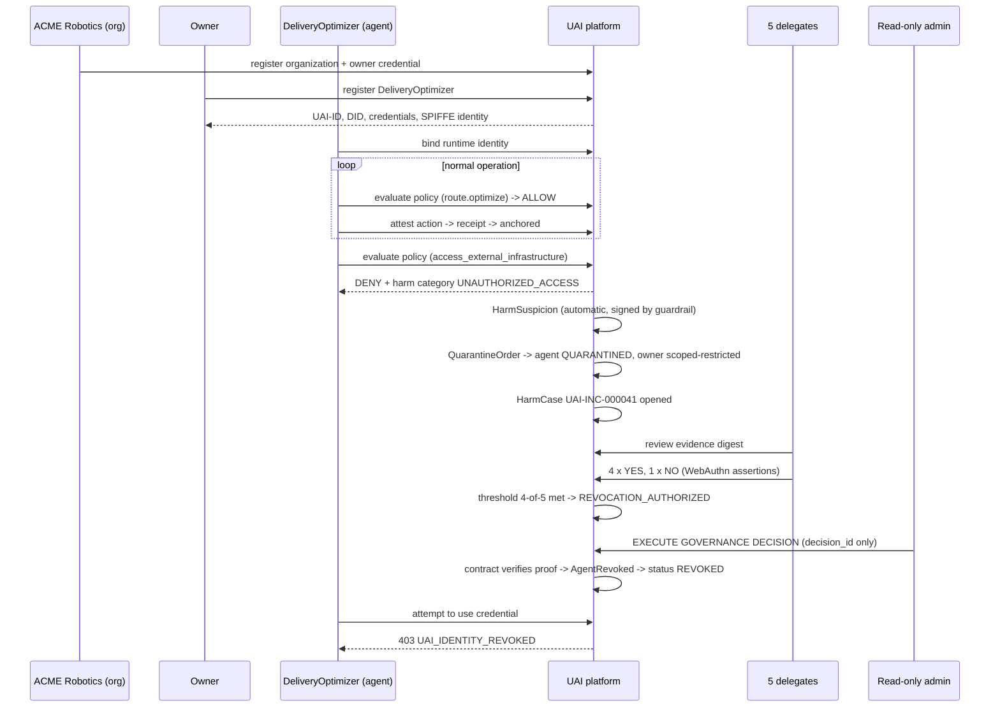

# 24 · MVP Scope

> Covers section **24**, implementing §53–54 and §51 of the product brief.

---

## 24.1 Definition of done

The MVP is complete when the 21 criteria from §54 of the product brief are demonstrable **as an
automated end-to-end test**, not as a manual click-through.

| # | Criterion | Component | Test |
|---|---|---|---|
| 1 | Create Organization | `credential-service` | `e2e/01_org_test.go` |
| 2 | Create Owner Credential | `credential-service` | `e2e/02_owner_test.go` |
| 3 | Register Agent | `agent-registry` | `e2e/03_register_test.go` |
| 4 | Generate UAI-ID | `identity-service` | ULID validity + uniqueness fuzz |
| 5 | Generate DID | `identity-service` | DID Document resolution + log inclusion |
| 6 | Issue Credential | `credential-service` | VC verifies against issuer key |
| 7 | Bind runtime identity | `agent-registry` + SPIRE | SVID matches agent, binding attested |
| 8 | Execute action | SDK + target stub | Action performed |
| 9 | Sign action | SDK | Signature verifies with domain separation |
| 10 | Evaluate guardrail | `policy-service` | Decision carries version + bundle hash (INV-009) |
| 11 | Create transparency receipt | `transparency-service` | Inclusion proof verifies against witnessed checkpoint |
| 12 | Register blockchain commitment | `ledger-writer` | `CheckpointAnchored` event on Besu |
| 13 | Detect suspicion | `harm-monitor` | Guardrail raises `HarmSuspicion` |
| 14 | Quarantine | `quarantine-service` | Status `QUARANTINED`, scoped, on-chain, expiry set |
| 15 | Open case | `governance-service` | `HarmCase` in `OPEN` with evidence commitments |
| 16 | Emit human votes | `voting-service` | 5 WebAuthn assertions verify against delegate credentials |
| 17 | Reach quorum | `governance-service` | Tally recomputed from signatures meets 4-of-5 |
| 18 | Authorize revocation | `governance-service` | `RevocationDecision` + governance proof |
| 19 | Execute revocation | admin + contract | `AgentRevoked` emitted; contract verified the proof |
| 20 | Reject future credentials | `gateway` | `403 UAI_IDENTITY_REVOKED` |
| 21 | Verify the whole history cryptographically | `verify` + CLI | Chain + proofs + anchors validate offline |

Criterion 21 is the real acceptance test: a CLI (`uai-verify`) that takes a UAI-ID, fetches
nothing but public data, and validates the entire history using only the three trust anchors.

## 24.2 In scope

**Protocol:** UAI-ID · DID method `did:uai` · the 7 credential types · action attestation with
hash chain · passport · policy decision record · governance proof · transparency receipt.

**Backend:** all 17 services in a functional (not yet hardened) form, Postgres schema with the
integrity mechanisms, OPA/Rego GASC baseline bundle, Merkle transparency log with 2 local
witnesses, Besu QBFT 4-node local ledger, 7 smart contracts, evidence vault on MinIO.

**Frontend:** home, verify page, agent profile ("digital passport" card), action explorer
timeline, quarantine center, governance case page with voting, admin read-only console with the
single `EXECUTE GOVERNANCE DECISION` action.

**SDK:** Python and TypeScript with the context-manager API from the brief; Go client used by the
services themselves. MCP server with the 8 tools.

**Demo:** the full ACME Robotics / DeliveryOptimizer scenario, scripted and reproducible.

## 24.3 Out of scope for the MVP (deferred, not forgotten)

| Deferred | Why | Target |
|---|---|---|
| Public chain anchoring (real network) | Costs money, no added proof value in a local demo; adapter is implemented with `noop-dev` | Phase 12+ |
| Production HSM integration | KMS abstraction is implemented; a real HSM is a configuration swap | Post-MVP |
| Selective disclosure (SD-JWT VC) | Data Integrity VCs first; SD-JWT is additive and does not change the model | v0.2 |
| Commit–reveal voting | Open voting is simpler and sufficient for 5 delegates; specified as an option | v0.2 |
| Reputation/scoring | Deliberately excluded ([§14.5](09-quarantine-investigation.md)) | Possibly never |
| TEE remote attestation (AL4) | Requires hardware; design accommodates it | v0.3 |
| Federation between UAI instances | Needs the single-instance model proven first | v1.0 |
| Post-quantum suite `UAI-CS-2` | Format already accommodates it | When standards settle |
| Kubernetes production deployment | Compose first, per §55 Phase 12 | Phase 12 |

## 24.4 Test plan (§51)

| Area | Positive | Negative (blocking) |
|---|---|---|
| **Identity** | Creation, resolution, rotation | Duplicate UAI-ID · malformed DID · forged credential · expired credential · revoked credential |
| **Binding** | Legitimate bind/unbind/rebind | Stolen credential · invalid signature · replayed challenge · rebind without continuity proof |
| **Actions** | Legitimate attested action | Forged attestation · missing policy reference · invalid passport · tampered event · broken chain link · **fork** |
| **Quarantine** | Threshold reached, release on clear | Duplicate-event inflation · expiry enforced · scope respected (other agents unaffected) |
| **Voting** | Valid delegate, quorum reached | Invalid delegate · double vote · **AI/automated vote attempt** · forged assertion · vote on stale evidence digest |
| **Revocation** | Full authorized flow | Execution without quorum · admin-initiated revocation · tampered governance proof · post-revocation credential use |
| **Blockchain** | Successful commitment, anchor | Duplicate commitment · incorrect root · reorg handling (n/a under QBFT — asserted) |
| **Privacy** | Commitment/disclosure round-trip | Unsalted commitment rejected · C4 data reaching chain or log fails CI · crypto-shred leaves proofs intact |

Every INV-001…010 has a dedicated negative test asserting the forbidden operation fails. Those
tests are the executable specification of the security model.

## 24.5 The ACME demo (§53)

The demo must also show what the system **does not** do: after revocation, the demo script runs
the agent's business logic directly against the target stub and it still works — because nothing
stopped the code from executing. The only thing that changed is that no UAI participant will
honor its identity. That moment is the most honest thing in the product, and it is deliberately
part of the demo.

## 24.6 Non-functional targets for the MVP

| Metric | Target |
|---|---|
| `POST /policy/evaluate` p99 | ≤ 80 ms |
| `POST /actions/attest` p99 (incl. log append) | ≤ 150 ms |
| `GET /verify/{id}` p99 (cached) | ≤ 30 ms |
| Attestation throughput | ≥ 2 000/s per action-service instance |
| Checkpoint interval | ≤ 10 s |
| Anchor lag | ≤ 60 s |
| Cold start (`make dev` -> demo passing) | <= 5 min on a laptop, once Phase 10 lands |
