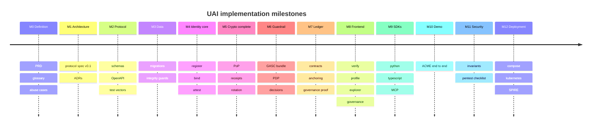

# 26 · Implementation Roadmap

> Covers section **26**, implementing §55 of the product brief. Phase-by-phase, with a
> demonstrable artifact at the end of each phase. No phase starts on a broken predecessor.

---

## 26.1 Phases to MVP

| Phase | Name | Deliverable | Demonstrable when |
|---|---|---|---|
| **0** | Product definition | PRD, glossary, actors, use cases, abuse cases, trust assumptions | Documents reviewed; abuse cases map to threat IDs |
| **1** | Architecture | This specification + C4 diagrams + ADRs | A third party can implement a verifier from the docs |
| **2** | Protocol | JSON Schemas, JSON-LD contexts, OpenAPI, **test vectors** | `uai-conformance` runs green against the vectors |
| **3** | Data | Postgres schema, migrations, ERD, repositories | `make migrate` + integrity tests (INV-003/006) pass |
| **4** | Backend core | identity, registry, credential, action services | Register → bind → attest works end to end |
| **5** | Cryptography | `pkg/uaicrypto`, PoP, receipts, rotation | All crypto test vectors reproduce byte-for-byte |
| **6** | Policy engine | OPA embedded, GASC baseline bundle, PDP | Decision records carry version + hash (INV-009) |
| **7** | Blockchain | 7 contracts, ledger-writer, anchoring | `AgentRevoked` requires a valid governance proof on-chain |
| **8** | Frontend | Verify, profile, explorer, quarantine, governance | The 5 UI surfaces work against the real API |
| **9** | SDK | Python + TypeScript + MCP server | The context-manager example from the brief runs |
| **10** | Demo | ACME scenario, scripted | `make demo` reproduces all 21 criteria |
| **11** | Security | Threat model validation, pentest checklist, invariant tests | Every INV negative test is blocking in CI |
| **12** | Deployment | Compose hardened, then Kubernetes + SPIRE | `make dev` ≤ 5 min; k8s manifests deploy |

Phases 0–11 are implemented. Phase 11 closed with `make pentest`, `make threats`,
`make invariant-coverage` and a CI workflow in which every gate blocks — see
[§20.4](13-threat-model.md#204-control-validation) for which controls exist and
[§20.5](13-threat-model.md#205-controls-named-in-201-that-do-not-exist-yet) for which do not.

Ordering rationale: cryptography (5) comes *after* a first working backend (4) deliberately — the
core is built against the spec's test vectors from phase 2, so phase 5 hardens and completes
rather than blocking. Policy (6) precedes blockchain (7) because the contracts read thresholds
from the policy registry, not the reverse.

## 26.2 Milestones

## 26.3 Beyond the MVP — toward an international network

### v0.2 — Credibility
Selective disclosure (SD-JWT VC) · commit–reveal voting · counter-attestation by relying parties ·
real public-chain anchoring · independent witness operators · first external conformance
implementation by a third party.

### v0.3 — Assurance
TEE remote attestation for `UAI-AL4` · hardware-backed delegate ceremony · formal verification of
the governance contracts · accredited third-party credential issuers · independent security
audit published in full.

### v0.5 — Federation
Multiple UAI instances with cross-instance verification · regional vaults and regional
governance · bridge to other identity ecosystems (`did:web` orgs already work; add EUDI wallet and
SPIFFE federation) · policy bundle localization per jurisdiction.

### v1.0 — Standardization
The part that matters most if this is to become infrastructure rather than a product:

| Track | Target body | Artifact |
|---|---|---|
| Action attestation format | IETF SCITT WG | Internet-Draft: UAI Action Attestation as a SCITT Signed Statement profile |
| DID method | W3C DID WG / DIF | `did:uai` method specification |
| Credential schemas | W3C VC WG | UAI credential vocabulary |
| Transparency profile | C2SP / Sigstore community | Checkpoint + witness profile |
| Governance model | Multi-stakeholder consortium | Charter, threshold policy, delegate accreditation |

### The strategic condition for success

UAI becomes real when **a relying party that has never spoken to the UAI foundation** rejects a
revoked credential using only public proofs. Everything in this roadmap is ordered to reach that
moment as early as possible: test vectors in phase 2, the offline `uai-verify` CLI as the MVP's
acceptance criterion, `did:web` support for organizations, and standards submission as a v1.0
gate rather than an afterthought.

## 26.4 What would make this fail

Recorded deliberately, because a roadmap that lists only successes is not a plan:

1. **Becoming a SaaS with a protocol-shaped brochure.** Mitigation: every phase ships public
   schemas and vectors; the reference implementation is not the specification.
2. **Governance capture** — one company or one government holding a decisive share of delegates
   or validators. Mitigation: thresholds across independent jurisdictions, public attribution of
   every vote, validator set changes on-chain.
3. **Overclaiming.** The first time UAI implies a kill switch it cannot deliver, the credibility
   loss is permanent. Mitigation: §26 of the brief is written into the protocol docs, the API
   responses, the UI copy and the demo itself.
4. **Adoption friction.** If integrating takes a week, nobody integrates. Mitigation: the SDK
   surface is one context manager; `verify` is one unauthenticated GET.
5. **Privacy incident.** One leak of C4 data through the ledger would end the project.
   Mitigation: salted commitments, classification enforced in CI, nothing but `bytes32` on-chain.
